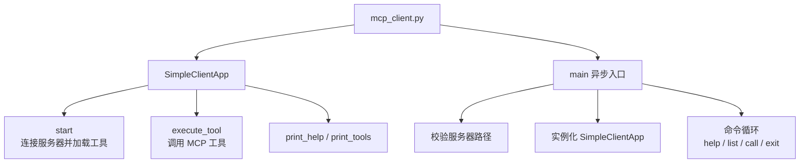
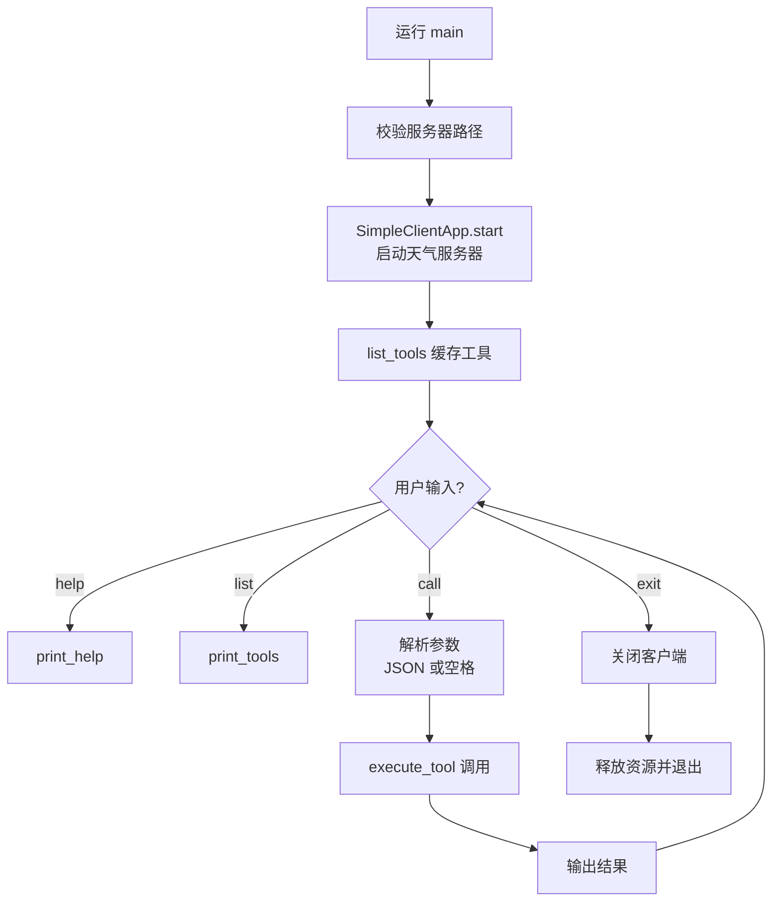

# mcp_client.py 拆解

## 定位与职责
- 标准命令行 MCP 客户端：启动服务器子进程、列出工具、解析命令并调用工具。
- 适合本地联调、教学演示和人工检查工具输出。

## 代码结构

- `SimpleClientApp` 管理服务器会话与命令分发（`02-agent-llm-mcp/mcp-demo/client/mcp_client.py:26`）
- 命令循环解析用户输入（`02-agent-llm-mcp/mcp-demo/client/mcp_client.py:133`）
- 启动入口负责校验与资源收尾（同上）

## 业务流程

1. 校验服务器脚本路径并启动天气服务器子进程。
2. 建立 MCP 会话并缓存工具列表。
3. 进入命令循环：`help`、`list`、`call` 三种主要命令。
4. `execute_tool` 调用 MCP 工具并打印结果；`exit` 清理资源后退出。

## 关键方法解析
- `start`：封装 stdio 通道、MCP 初始化并打印可用工具。
- `execute_tool`：根据工具名取 schema，执行工具并返回 `content`。
- `print_help` / `print_tools`：说明命令格式与参数。
- 命令解析兼容 JSON 与空格分隔，降低使用门槛。
