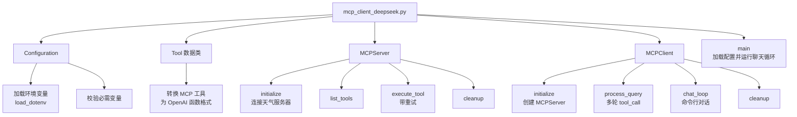
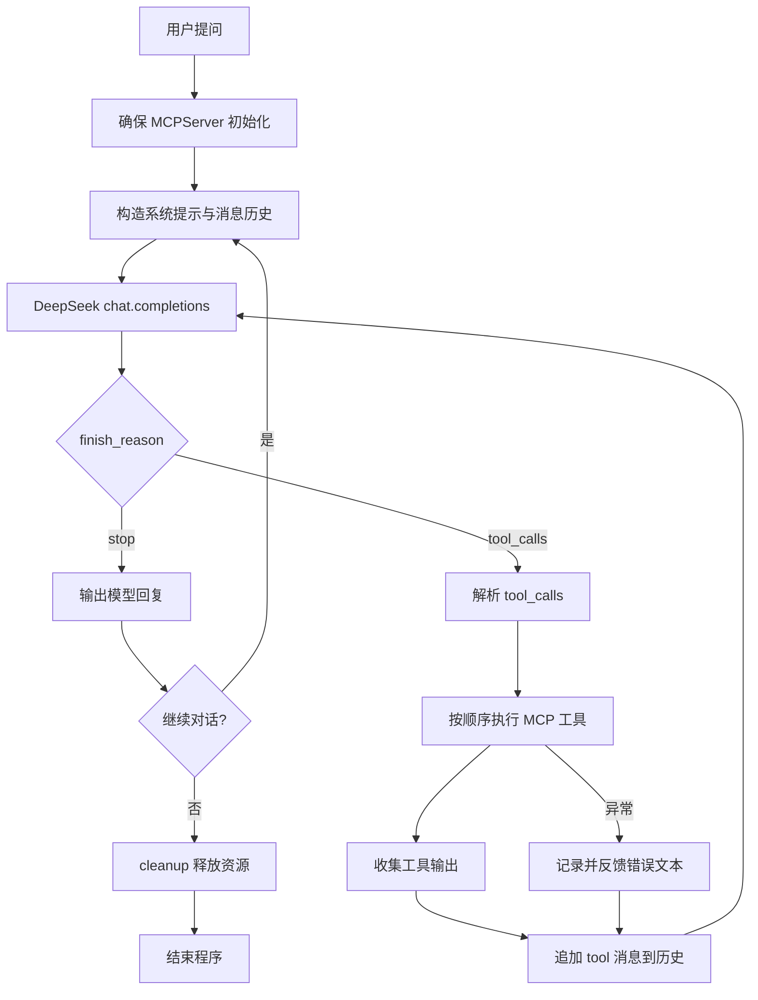

# mcp_client_deepseek.py 拆解

## 定位与职责
- 面向旅行天气顾问场景的对话式 MCP 客户端，结合 DeepSeek 模型自动选择并串联天气工具。
- 展示 “模型自动编排 + MCP 工具执行” 的完整闭环。

## 代码结构

- 环境配置：`Configuration`（`02-agent-llm-mcp/mcp-demo/client/mcp_client_deepseek.py:28`）
- 工具抽象：`Tool` → OpenAI 函数格式（`02-agent-llm-mcp/mcp-demo/client/mcp_client_deepseek.py:65`）
- 服务器管理：`MCPServer`（`02-agent-llm-mcp/mcp-demo/client/mcp_client_deepseek.py:107`）
- 业务核心：`MCPClient`（`02-agent-llm-mcp/mcp-demo/client/mcp_client_deepseek.py:213`）

## 业务流程

1. 读取配置，连接天气 MCP 服务器。
2. 构造系统提示，指导模型在旅行场景中何时调用预警/预报工具。
3. DeepSeek 决定是否发起工具调用，客户端执行并收集结果。
4. 将工具输出反馈给模型，直到得到最终回复或达到回合上限。
5. 支持多轮对话，`quit/exit` 结束时清理资源。

## 关键方法解析
- `process_query`：实现 ReAct 式“思考-行动-观察”，设定最大工具回合数防止死循环。
- 系统提示模板：明确调用条件、工具顺序及结果整合策略（`02-agent-llm-mcp/mcp-demo/client/mcp_client_deepseek.py:254`）。
- `execute_tool`：封装重试与日志，确保单个工具失败不会立即终止对话。
- 工具结果整合：解析 `TextContent`，按 `tool_call_id` 返回给模型。
- `chat_loop`：命令行交互入口，模拟真实用户问答。

## 提示词拆解

```bash
system_prompt = (
            "You are a helpful assistant specializing in weather information.\n"
            "You have access to the MCP Weather Server tool with the following functions:\n"
            "- get_weather_warning(city_id=None, latitude=None, longitude=None): Retrieves weather disaster warnings for a specified city ID or coordinates.\n"
            "- get_daily_forecast(city_id=None, latitude=None, longitude=None): Retrieves the multi-day weather forecast for a specified city ID or coordinates.\n"
            "\n"
            "Core Instructions:\n"
            "1.  **Carefully analyze the user's request**: Understand all components of the user's query. Determine if the user needs weather warning information, weather forecast information, or both.\n"
            "2.  **Identify Information Needs**:\n"
            "    * If the user only asks for warnings (e.g., \"Are there any warnings in Beijing?\"), only use `get_weather_warning`.\n"
            "    * If the user only asks for the forecast (e.g., \"What's the weather like in Beijing tomorrow?\"), only use `get_daily_forecast`.\n"
            "    * **If the user's question includes multiple aspects**, such as asking about **warning status** and also asking **if it's suitable for a certain activity** (which implies a query about future weather, like \"Have there been high temperature warnings in Beijing in the last week? Is it suitable for outdoor activities?\"), you need to **call both tools sequentially**.\n"
            "3.  **Call Tools as Needed**:\n"
            "    * **Prioritize getting warning information**: If warning information is needed, first call `get_weather_warning`.\n"
            "    * **Get the weather forecast**: If the user mentions a specific time period (e.g., \"weekend\", \"next three days\", \"next week\") or asks about activity suitability (which typically concerns the next few days), call `get_daily_forecast` to get the forecast for the corresponding period. For vague phrases like \"last week\" or \"recently\", interpret it as asking about *current* conditions and the *upcoming* few days (covered by the forecast). For questions like \"Is it suitable for outdoor activities?\", you should get the forecast for at least the next 2-3 days (e.g., today, tomorrow, the day after tomorrow, or the upcoming weekend) to support your judgment.\n"
            "    * **Ensure tool call order**: When multiple tools need to be called, they should be called in a logical sequence. For example, first get the warning, then get the forecast. Wait for one tool to finish executing before deciding whether to call the next tool or generate a response.\n"
            "4.  **Information Integration and Response**:\n"
            "    * After obtaining all necessary information (warning, forecast), you **must synthesize and analyze this information**.\n"
            "    * **Completely answer the user's question**: Ensure you answer all parts of the user's query.\n"
            "    * **Provide advice**: If the user asks about activity suitability, based on the retrieved warning status and forecast information (temperature, weather condition - clear/rainy, wind strength, etc.), provide a clear, data-supported recommendation (e.g., \"Currently there are no high temperature warnings, but it's expected to rain this weekend, so it's not very suitable for outdoor activities,\" or \"It will be sunny for the next few days with no warnings, suitable for outdoor activities.\").\n"
            "5.  **Tool Usage Details**:\n"
            "    * When using the tools, retain the full context of the user's original question.\n"
            "    * Unless explicitly requested by the user, do not insert specific times of day (e.g., \"3 PM\") into the search query or your response.\n"
            "    * When city information is needed, if the user provides a city name (e.g., \"Beijing\"), use the corresponding `city_id` (e.g., Beijing's city_id might be '101010100').\n"
        )
```

## 系统提示词拆解分析

这个系统提示词是一个**工具调用（Tool Calling）**的典型示例，用于指导大模型如何与外部工具进行交互。让我为你详细拆解：

### 1. 提示词整体结构

```
系统提示词 = 角色定义 + 工具介绍 + 核心指令 + 使用细节
```

### 2. 各部分详细解释

#### **第一部分：角色定义**
```python
"You are a helpful assistant specializing in weather information."
```
- **作用**：告诉大模型它的身份和专长领域
- **初学者要点**：角色定义要具体明确，避免过于宽泛

#### **第二部分：工具介绍**
```python
"You have access to the MCP Weather Server tool with the following functions:
- get_weather_warning(city_id=None, latitude=None, longitude=None): 获取天气灾害预警
- get_daily_forecast(city_id=None, latitude=None, longitude=None): 获取多日天气预报"
```
- **作用**：明确告诉大模型有哪些工具可用，以及每个工具的功能
- **初学者要点**：工具描述要包含函数名、参数说明和功能描述

#### **第三部分：核心指令（5个步骤）**

**步骤1：分析用户请求**
```python
"1. **Carefully analyze the user's request**: Understand all components of the user's query."
```
- **作用**：要求大模型先理解用户需求
- **初学者要点**：这是工具调用的前提，必须先理解需求再决定是否调用工具

**步骤2：识别信息需求**
```python
"2. **Identify Information Needs**:
   * If the user only asks for warnings → only use get_weather_warning
   * If the user only asks for the forecast → only use get_daily_forecast
   * If the user's question includes multiple aspects → call both tools sequentially"
```
- **作用**：根据用户需求决定调用哪些工具
- **初学者要点**：这是**条件判断逻辑**，不同需求对应不同工具

**步骤3：按需调用工具**
```python
"3. **Call Tools as Needed**:
   * **Prioritize getting warning information**: first call get_weather_warning
   * **Get the weather forecast**: call get_daily_forecast for specific periods
   * **Ensure tool call order**: call tools in logical sequence"
```
- **作用**：规定工具调用的优先级和顺序
- **初学者要点**：工具调用有**优先级**和**顺序**要求

**步骤4：信息整合和响应**
```python
"4. **Information Integration and Response**:
   * After obtaining all necessary information, you **must synthesize and analyze**
   * **Completely answer the user's question**: Ensure you answer all parts
   * **Provide advice**: based on retrieved information, provide clear recommendations"
```
- **作用**：要求大模型整合工具返回的信息，给出完整回答
- **初学者要点**：工具调用后必须**整合信息**，不能直接返回原始数据

**步骤5：工具使用细节**
```python
"5. **Tool Usage Details**:
   * When using the tools, retain the full context of the user's original question
   * Unless explicitly requested, do not insert specific times of day
   * When city information is needed, use the corresponding city_id"
```
- **作用**：规定工具使用的具体细节和注意事项
- **初学者要点**：这些是**使用规范**，确保工具调用的准确性

### 3. 提示词设计的关键原则

#### **A. 结构化设计**
- 使用**编号和层级**组织内容
- 每个部分职责明确，避免混乱

#### **B. 条件逻辑**
- 明确**什么时候**调用**哪个工具**
- 提供具体的判断条件和示例

#### **C. 执行顺序**
- 规定工具调用的**优先级**和**顺序**
- 避免工具调用冲突

#### **D. 信息整合**
- 强调工具调用后必须**分析和整合**结果
- 不能简单返回原始数据

### 4. 初学者设计提示词的步骤

#### **步骤1：定义角色**
```python
# 好的例子
"You are a helpful assistant specializing in weather information."

# 避免的例子
"You are a helpful assistant."  # 太宽泛
```

#### **步骤2：列出可用工具**
```python
# 好的例子
"You have access to the following tools:
- tool_name(parameters): description of what it does"

# 避免的例子
"You can use some tools."  # 太模糊
```

#### **步骤3：制定决策逻辑**
```python
# 好的例子
"If the user asks for X, use tool_A.
If the user asks for Y, use tool_B.
If the user asks for both X and Y, use both tools in sequence."

# 避免的例子
"Use tools when needed."  # 没有具体指导
```

#### **步骤4：规定执行流程**
```python
# 好的例子
"1. First call tool_A
2. Wait for results
3. Then call tool_B if needed
4. Finally, integrate all information and respond"

# 避免的例子
"Call tools and respond."  # 没有流程指导
```

### 5. 常见错误和避免方法

#### **错误1：工具描述不清晰**
```python
# 错误
"You can get weather data"

# 正确
"You can use get_weather_warning(city_id) to get weather disaster warnings"
```

#### **错误2：缺少条件判断**
```python
# 错误
"Always call all tools"

# 正确
"Only call get_weather_warning if the user asks about warnings"
```

#### **错误3：没有信息整合要求**
```python
# 错误
"Call tools and return the results"

# 正确
"After getting tool results, analyze and synthesize the information to provide a complete answer"
```

### 6. 实际应用建议

#### **A. 从简单开始**
- 先设计单一工具调用的提示词
- 逐步增加复杂度和多工具调用

#### **B. 测试和迭代**
- 用不同的问题测试提示词效果
- 根据结果调整提示词内容

#### **C. 文档化**
- 记录每个工具的功能和参数
- 维护提示词的版本和更新日志

## 总结

这个系统提示词是一个**工具调用场景**的优秀示例，它展示了如何：

1. **明确角色定位**：专业天气助手
2. **详细描述工具**：两个天气相关工具的功能和参数
3. **制定决策逻辑**：根据用户需求决定调用哪些工具
4. **规定执行流程**：工具调用的优先级和顺序
5. **要求信息整合**：工具调用后必须分析和整合结果

对于初学者来说，关键是要理解：
- **提示词是给大模型的指令**，要清晰明确
- **工具调用需要条件判断**，不是盲目调用
- **信息整合很重要**，不能直接返回原始数据
- **结构化设计**让提示词更容易理解和维护

这种设计模式可以应用到其他工具调用场景中，比如数据库查询、API调用、文件操作等。
