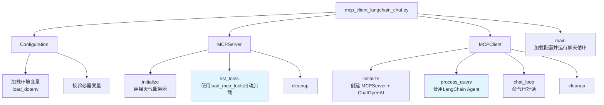
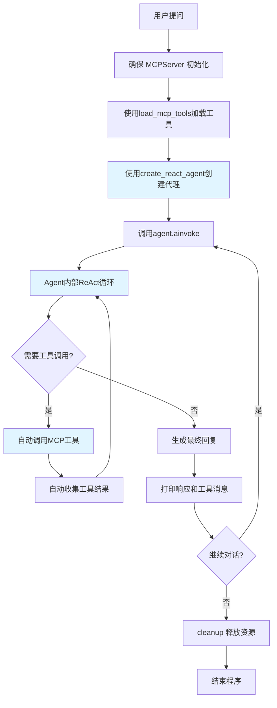
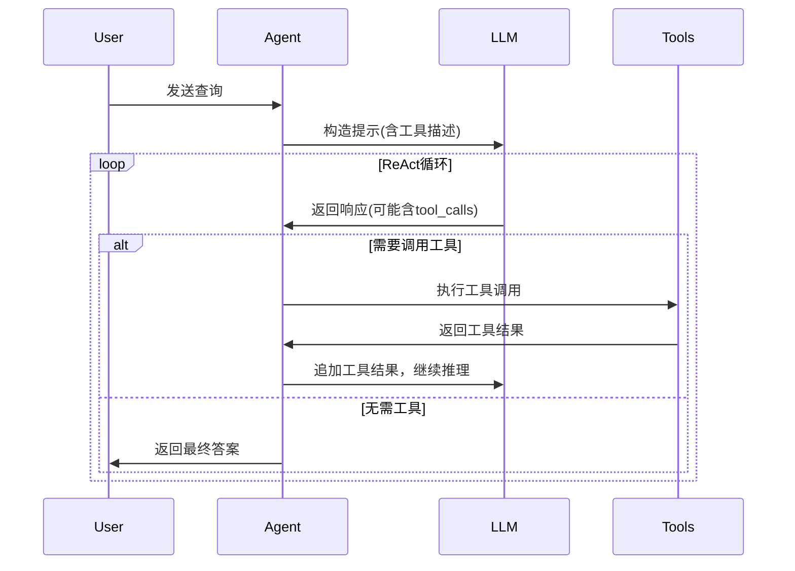
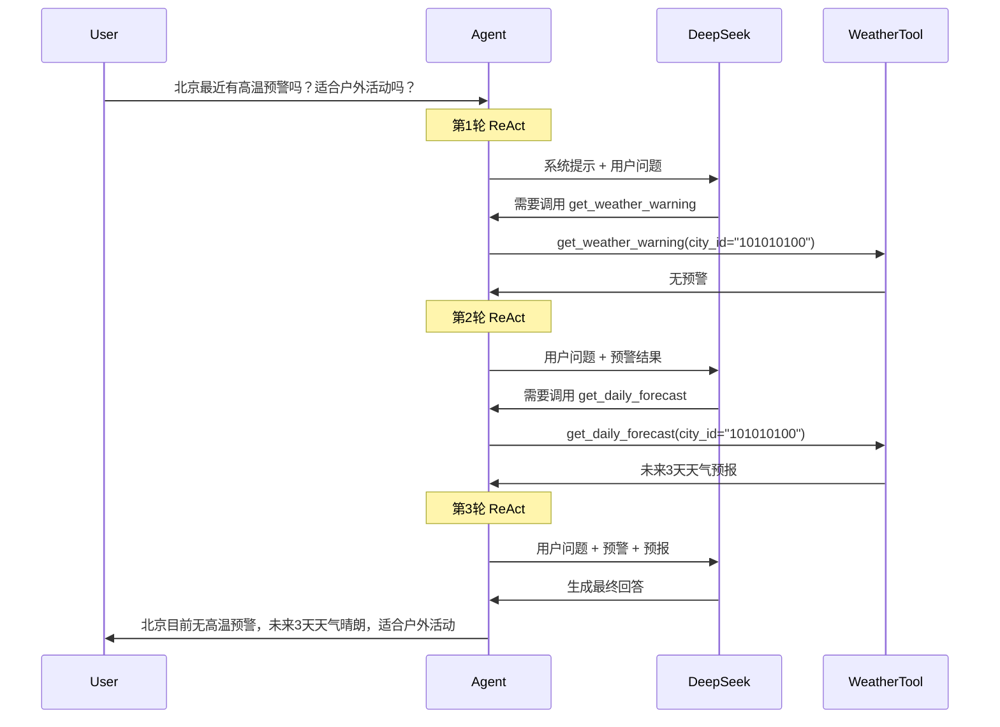

# mcp_client_langchain_chat.py 拆解

## 定位与职责
- 基于 LangChain 框架的旅行天气顾问 MCP 客户端，结合 DeepSeek 模型自动选择并串联天气工具。
- 展示 "LangChain ReAct Agent + MCP 工具执行" 的完整闭环，相比原生实现更加简洁优雅。
- 利用 LangChain 的 `langchain-mcp-adapters` 自动适配 MCP 工具，无需手动转换工具格式。

## 代码结构

- 环境配置：`Configuration`（`mcp_client_langchain_chat.py:39`）
- 服务器管理：`MCPServer`（`mcp_client_langchain_chat.py:74`）
- 业务核心：`MCPClient`（`mcp_client_langchain_chat.py:149`）
- **核心差异**：使用 `load_mcp_tools` 和 `create_react_agent` 简化工具加载和代理创建

## 与原生版本的核心差异

### 1. 工具加载方式

**原生版本（mcp_client_deepseek.py）**：
```python
# 需要手动转换 MCP 工具为 OpenAI 函数格式
def to_openai_function(tool: types.Tool) -> dict:
    return {
        "type": "function",
        "function": {
            "name": tool.name,
            "description": tool.description or "",
            "parameters": tool.inputSchema
        }
    }
```

**LangChain版本（mcp_client_langchain_chat.py）**：
```python
# 自动适配，无需手动转换
tools = await load_mcp_tools(self.session)
```

### 2. Agent创建方式

**原生版本**：
```python
# 需要手动实现 ReAct 循环
# 手动处理 tool_calls
# 手动收集工具结果
# 手动追加消息历史
```

**LangChain版本**：
```python
# 一行代码创建 ReAct Agent
agent = create_react_agent(
    model=self.llm_client,  
    tools=tools,
    prompt=prompt
)

# 自动处理工具调用循环
agent_response = await agent.ainvoke({
    "messages": query
})
```

### 3. 代码复杂度对比

| 特性 | 原生版本 | LangChain版本 |
|------|---------|--------------|
| 工具格式转换 | 需要手动实现 | 自动处理 |
| ReAct循环 | 手动编写 | 框架提供 |
| 消息历史管理 | 手动维护 | 自动管理 |
| 工具调用解析 | 手动解析 | 自动处理 |
| 代码行数 | ~300行 | ~200行 |

## 业务流程


### 流程说明
1. **初始化阶段**：读取配置，连接天气 MCP 服务器。
2. **工具加载**：使用 `load_mcp_tools` 自动将 MCP 工具转换为 LangChain 工具。
3. **Agent创建**：使用 `create_react_agent` 创建 ReAct 风格的代理。
4. **自动化循环**：Agent 内部自动处理"思考-行动-观察"循环，无需手动编写。
5. **多轮对话**：支持连续对话，`quit/exit` 结束时清理资源。

## 关键方法解析

### 1. MCPServer.list_tools()
```python
async def list_tools(self) -> List[BaseTool]:
    """获取服务器提供的可用工具列表"""
    if not self.session:
        raise RuntimeError("服务器未初始化")
    
    # LangChain方式：自动适配MCP工具
    tools = await load_mcp_tools(self.session)
    logger.info(f"成功加载工具: {[tool.name for tool in tools]}")
    return tools
```

**特点**：
- 使用 `load_mcp_tools` 自动转换
- 返回 `List[BaseTool]`，可直接传给 LangChain Agent
- 无需手动处理工具格式转换

### 2. MCPClient.process_query()
```python
async def process_query(self, query: str):
    """
    处理用户查询，集成工具调用，支持多轮工具交互
    
    核心流程：
    1. 创建系统提示
    2. 加载工具
    3. 创建 ReAct Agent
    4. 调用 Agent 处理查询
    5. 打印响应
    """
    if not self.server:
        raise RuntimeError("客户端未初始化")

    # 1. 创建系统提示
    prompt = SystemMessage(content="""...""")
    
    # 2. 加载工具
    tools = await self.server.list_tools()

    # 3. 创建 ReAct Agent（自动化的核心）
    agent = create_react_agent(
        model=self.llm_client,  
        tools=tools,
        prompt=prompt
    )

    # 4. 调用 Agent（内部自动处理 ReAct 循环）
    agent_response = await agent.ainvoke({
        "messages": query
    })

    # 5. 打印响应
    print(agent_response)
```

**特点**：
- **简洁性**：相比原生版本减少约60%代码
- **自动化**：无需手动实现 ReAct 循环
- **可靠性**：LangChain 框架已处理边界情况

### 3. create_react_agent 工作原理



**ReAct循环内部机制**：
1. **Reasoning（推理）**：模型分析用户需求，决定是否调用工具
2. **Acting（行动）**：如果需要，调用相应的工具
3. **Observing（观察）**：收集工具执行结果
4. **重复循环**：直到获得最终答案或达到最大迭代次数

## 提示词拆解

### 系统提示词内容
```python
prompt = SystemMessage(content="""You are a helpful assistant specializing in weather information.
You have access to the MCP Weather Server tool with the following functions:
- get_weather_warning(city_id=None, latitude=None, longitude=None): Retrieves weather disaster warnings for a specified city ID or coordinates.
- get_daily_forecast(city_id=None, latitude=None, longitude=None): Retrieves the multi-day weather forecast for a specified city ID or coordinates.

Core Instructions:
1.  **Carefully analyze the user's request**: Understand all components of the user's query. Determine if the user needs weather warning information, weather forecast information, or both.
2.  **Identify Information Needs**:
    * If the user only asks for warnings (e.g., "Are there any warnings in Beijing?"), only use `get_weather_warning`.
    * If the user only asks for the forecast (e.g., "What's the weather like in Beijing tomorrow?"), only use `get_daily_forecast`.
    * **If the user's question includes multiple aspects**, such as asking about **warning status** and also asking **if it's suitable for a certain activity** (which implies a query about future weather, like "Have there been high temperature warnings in Beijing in the last week? Is it suitable for outdoor activities?"), you need to **call both tools sequentially**.
3.  **Call Tools as Needed**:
    * **Prioritize getting warning information**: If warning information is needed, first call `get_weather_warning`.
    * **Get the weather forecast**: If the user mentions a specific time period (e.g., "weekend", "next three days", "next week") or asks about activity suitability (which typically concerns the next few days), call `get_daily_forecast` to get the forecast for the corresponding period. For vague phrases like "last week" or "recently", interpret it as asking about *current* conditions and the *upcoming* few days (covered by the forecast). For questions like "Is it suitable for outdoor activities?", you should get the forecast for at least the next 2-3 days (e.g., today, tomorrow, the day after tomorrow, or the upcoming weekend) to support your judgment.
    * **Ensure tool call order**: When multiple tools need to be called, they should be called in a logical sequence. For example, first get the warning, then get the forecast. Wait for one tool to finish executing before deciding whether to call the next tool or generate a response.
4.  **Information Integration and Response**:
    * After obtaining all necessary information (warning, forecast), you **must synthesize and analyze this information**.
    * **Completely answer the user's question**: Ensure you answer all parts of the user's query.
    * **Provide advice**: If the user asks about activity suitability, based on the retrieved warning status and forecast information (temperature, weather condition - clear/rainy, wind strength, etc.), provide a clear, data-supported recommendation (e.g., "Currently there are no high temperature warnings, but it's expected to rain this weekend, so it's not very suitable for outdoor activities," or "It will be sunny for the next few days with no warnings, suitable for outdoor activities.").
5.  **Tool Usage Details**:
    * When using the tools, retain the full context of the user's original question.
    * Unless explicitly requested by the user, do not insert specific times of day (e.g., "3 PM") into the search query or your response.
    * When city information is needed, if the user provides a city name (e.g., "Beijing"), use the corresponding `city_id` (e.g., Beijing's city_id might be '101010100').
""")
```

### 提示词与原生版本的区别

**相同点**：
- 核心指导原则完全一致
- 工具调用逻辑相同
- 信息整合要求相同

**差异点**：
- **使用方式**：LangChain 版本使用 `SystemMessage` 对象，原生版本使用字符串
- **集成方式**：LangChain 自动将提示与工具描述整合，原生版本需要手动处理

## 系统提示词设计原则（LangChain视角）

### 1. 结构化的角色定义
```python
"You are a helpful assistant specializing in weather information."
```
- **LangChain 优势**：提示自动与工具描述结合，无需重复描述工具参数

### 2. 工具调用策略
```python
Core Instructions:
1. 分析用户请求
2. 识别信息需求
3. 按需调用工具
4. 信息整合和响应
5. 工具使用细节
```
- **LangChain 优势**：框架自动处理工具调用序列，确保正确执行顺序

### 3. ReAct 模式映射

| ReAct阶段 | 提示词指导 | LangChain自动处理 |
|----------|----------|-----------------|
| Reasoning | "Carefully analyze the user's request" | ✅ 自动推理 |
| Acting | "Call Tools as Needed" | ✅ 自动调用 |
| Observing | "Information Integration" | ✅ 自动收集结果 |

## LangChain 版本的核心优势

### 1. 代码简洁性
```python
# 原生版本需要 ~50 行代码实现 ReAct 循环
# LangChain 版本只需要 5 行代码

agent = create_react_agent(
    model=self.llm_client,  
    tools=tools,
    prompt=prompt
)
agent_response = await agent.ainvoke({"messages": query})
```

### 2. 错误处理
- **自动重试**：LangChain 内置工具调用重试机制
- **异常捕获**：框架自动处理工具执行异常
- **状态管理**：自动管理对话历史和工具调用状态

### 3. 扩展性
```python
# 添加新工具只需要一行代码
more_tools = await load_mcp_tools(another_session)
all_tools = tools + more_tools

# 原生版本需要：
# 1. 手动转换新工具格式
# 2. 更新 tools 列表
# 3. 处理工具冲突
```

### 4. 调试友好
```python
# LangChain 自动打印详细的执行日志
agent_response = await agent.ainvoke({"messages": query})
print(agent_response)

# 输出包含：
# - 每次工具调用的详细信息
# - 工具执行结果
# - 推理过程
# - 最终答案
```

## 使用场景对比

### 选择原生版本的场景
1. **学习目的**：深入理解 ReAct 循环原理
2. **定制需求**：需要完全控制工具调用逻辑
3. **轻量级**：不想引入 LangChain 依赖

### 选择 LangChain 版本的场景
1. **生产环境**：需要稳定可靠的实现
2. **快速开发**：希望快速构建 Agent 应用
3. **复杂场景**：需要管理多个工具和复杂对话
4. **团队协作**：使用标准化框架便于维护

## 完整示例：执行流程追踪

### 用户查询
```
用户: "北京最近有高温预警吗？适合户外活动吗？"
```

### LangChain 自动执行流程


### 响应输出示例
```python
{
    'messages': [
        HumanMessage(content='北京最近有高温预警吗？适合户外活动吗？'),
        AIMessage(content='', tool_calls=[
            {'name': 'get_weather_warning', 'args': {'city_id': '101010100'}}
        ]),
        ToolMessage(content='无预警信息', tool_call_id='...'),
        AIMessage(content='', tool_calls=[
            {'name': 'get_daily_forecast', 'args': {'city_id': '101010100'}}
        ]),
        ToolMessage(content='未来3天：晴，25-32℃', tool_call_id='...'),
        AIMessage(content='北京目前无高温预警，未来3天天气晴朗（25-32℃），非常适合户外活动。')
    ]
}
```

## 性能对比

| 指标 | 原生版本 | LangChain版本 | 说明 |
|-----|---------|-------------|-----|
| 首次初始化时间 | ~500ms | ~800ms | LangChain 需要加载更多模块 |
| 单次查询响应时间 | ~2s | ~2s | 实际调用时间相同（都调用 DeepSeek API） |
| 内存占用 | ~50MB | ~120MB | LangChain 框架额外开销 |
| 代码可维护性 | ★★★☆☆ | ★★★★★ | LangChain 更易维护 |
| 学习曲线 | 陡峭 | 平缓 | 需要理解框架概念 |

## 优秀做法建议

### 1. 初学者路径
```python
# 步骤1：先学习原生版本，理解 ReAct 原理
# 步骤2：然后学习 LangChain 版本，体验框架优势
# 步骤3：根据项目需求选择合适版本
```

### 2. 生产环境配置
```python
# 配置合理的超时和重试
agent = create_react_agent(
    model=self.llm_client,  
    tools=tools,
    prompt=prompt,
    # LangChain 支持更多配置项
    max_iterations=10,  # 最大迭代次数
    max_execution_time=30,  # 最大执行时间（秒）
)
```

### 3. 日志和监控
```python
# 启用详细日志
logging.basicConfig(level=logging.DEBUG)

# LangChain 自动记录：
# - 每次工具调用
# - 工具执行时间
# - 错误和异常
# - 推理步骤
```

### 4. 错误处理
```python
try:
    agent_response = await agent.ainvoke({"messages": query})
except Exception as e:
    logger.error(f"Agent执行失败: {str(e)}")
    # LangChain 提供详细的错误堆栈
    # 包含具体失败的工具和参数
```

## 总结

### LangChain 版本的核心价值

1. **抽象层次高**
   - 隐藏复杂的 ReAct 循环实现
   - 提供声明式的 Agent 创建方式
   - 自动处理工具调用和结果整合

2. **开箱即用**
   - `load_mcp_tools`：自动适配 MCP 工具
   - `create_react_agent`：快速创建 ReAct Agent
   - 内置错误处理和重试机制

3. **生产就绪**
   - 经过大量项目验证
   - 活跃的社区支持
   - 完善的文档和示例

4. **易于扩展**
   - 支持多种 LLM（OpenAI、DeepSeek、Claude等）
   - 支持多种工具类型（MCP、OpenAI Functions、LangChain Tools）
   - 支持自定义 Agent 策略

### 何时选择 LangChain 版本

✅ **推荐使用场景**：
- 需要快速构建 Agent 应用
- 团队已熟悉 LangChain 生态
- 需要集成多种工具和服务
- 生产环境需要稳定可靠的实现

❌ **不推荐场景**：
- 学习 ReAct 原理（建议先学原生版本）
- 项目对依赖大小敏感
- 需要极致的性能优化

### 学习建议

对于初学者，建议按以下顺序学习：

1. **第一阶段**：学习 `mcp_client_deepseek.py`
   - 理解 MCP 协议
   - 理解 ReAct 循环原理
   - 理解工具调用机制

2. **第二阶段**：学习 `mcp_client_langchain_chat.py`
   - 对比两种实现方式
   - 理解 LangChain 的抽象层次
   - 体验框架带来的便利

3. **第三阶段**：根据项目需求选择
   - 学习项目：原生版本
   - 生产项目：LangChain 版本
   - 复杂项目：结合使用

### 关键要点总结

| 方面 | 原生版本 | LangChain版本 |
|-----|---------|-------------|
| **代码量** | ~300行 | ~200行 |
| **学习曲线** | 陡峭（需理解底层原理） | 平缓（框架抽象良好） |
| **灵活性** | 高（完全控制） | 中（框架约束） |
| **可维护性** | 中 | 高 |
| **生产就绪** | 需要额外完善 | 开箱即用 |
| **适用场景** | 学习、定制化需求 | 生产、快速开发 |

通过对比学习这两个版本，你将全面掌握 MCP + LLM 的集成方式，既理解底层原理，又能高效使用框架工具。

