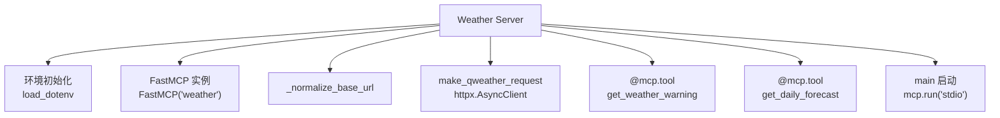
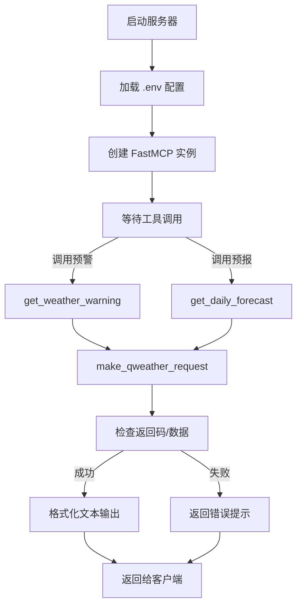

# weather_server.py 拆解

## 定位与职责
- 充当 FastMCP 服务器，向外暴露天气预警与天气预报两个工具。
- 负责加载配置、调用和风天气 API，并将结果格式化成 Agent 友好的文本。

## 代码结构

- 配置读取与 FastMCP 初始化：`02-agent-llm-mcp/mcp-demo/server/weather_server.py:32`, `02-agent-llm-mcp/mcp-demo/server/weather_server.py:37`
- API 基址修正：`_normalize_base_url`（`02-agent-llm-mcp/mcp-demo/server/weather_server.py:45`）
- HTTP 调用封装：`make_qweather_request`（`02-agent-llm-mcp/mcp-demo/server/weather_server.py:68`）
- 工具注册与文本格式化：`get_weather_warning`、`get_daily_forecast`（`135`, `196`）
- 启动入口：`mcp.run(transport='stdio')`（`239`）

## 业务流程

1. 启动时读取环境变量、创建 FastMCP 实例。
2. 工具被调用后组装请求参数，调用和风天气 API。
3. 校验响应并格式化输出。
4. 将结果返回给 MCP 客户端或外部 Agent。

## 关键方法解析
- `_normalize_base_url`：自动补全协议与尾部斜杠，避免 `urljoin` 覆盖路径。
- `make_qweather_request`：统一日志、异常、超时处理等。
- `format_warning` / `format_daily_forecast`：将 JSON 数据转换成便于阅读的多段文本。
- `@mcp.tool` 装饰器：把 Python 函数注册成 MCP 工具，供 Agent 安全调用。
