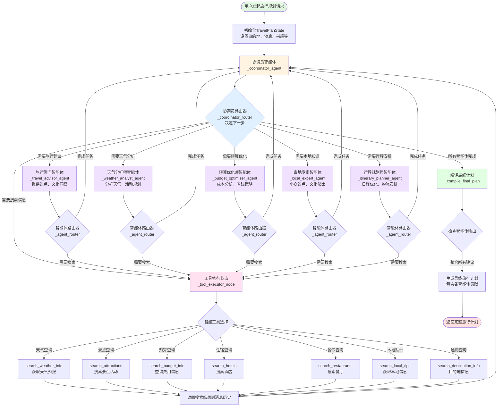

# 🌍 AI旅行规划智能体 (AI Trip Planner Agent)

一个基于LangGraph多智能体协作的智能旅行规划系统，由 OpenAI 兼容大模型（ChatOpenAI）与 DuckDuckGo 搜索驱动。

## 🏗️ 系统架构

### 整体架构
```
┌─────────────────┐    ┌─────────────────┐    ┌─────────────────┐
│   Streamlit     │    │   FastAPI       │    │   LangGraph     │
│   前端界面      │◄──►│   后端API       │◄──►│   多智能体系统  │
│                 │    │                 │    │                 │
└─────────────────┘    └─────────────────┘    └─────────────────┘
```

### 技术栈
- **前端**: Streamlit (Python Web框架)
- **后端**: FastAPI (高性能异步API框架)
- **AI引擎**: LangGraph (多智能体协作框架)
- **大语言模型**: ChatOpenAI（OpenAI 兼容接口，可接入 DeepSeek、通义千问等）
- **搜索服务**: DuckDuckGo实时搜索
- **数据存储**: JSON文件存储 + 内存缓存
- **部署**: Docker容器化 + 可选的Kubernetes

## 🤖 AI智能体团队

### 核心智能体
1. **🎯 协调员智能体** - 工作流编排与决策综合
2. **✈️ 旅行顾问** - 目的地专业知识与实时搜索
3. **💰 预算优化师** - 成本分析与实时定价
4. **🌤️ 天气分析师** - 天气情报与当前数据
5. **🏠 当地专家** - 内部知识与实时本地信息
6. **📅 行程规划师** - 日程优化与物流安排

### 智能体协作流程

#### 简化流程
```
用户请求 → 协调员 → 并行执行各专业智能体 → 结果整合 → 生成报告
```

#### 详细工作流程图



#### 核心交互说明

1. **入口流程** (`run_travel_planning`)
   - 接收用户旅行需求
   - 初始化 `TravelPlanState` 状态
   - 启动 LangGraph 工作流

2. **协调员循环** (`_coordinator_agent` + `_coordinator_router`)
   - 分析当前状态和已完成的智能体
   - 决定下一个要调用的智能体
   - 综合所有智能体的输出
   - 判断是否完成规划

3. **专业智能体执行** (各个 `_*_agent` 方法)
   - 接收协调员指令
   - 执行专业分析任务
   - 如需实时数据，请求工具搜索
   - 将结果存入 `agent_outputs`

4. **工具执行** (`_tool_executor_node`)
   - 解析智能体的搜索请求
   - 智能选择合适的搜索工具
   - 执行工具并返回结果
   - 将搜索结果添加到消息历史

5. **智能体路由** (`_agent_router`)
   - 检查智能体是否需要更多信息
   - 决定返回协调员或调用工具
   - 维护工作流的循环执行

6. **结果编译** (`_compile_final_plan`)
   - 整合所有智能体的输出
   - 生成结构化的旅行计划
   - 包含各智能体的专业建议

## 🚀 快速开始

### 环境要求
- Python 3.10+
- 8GB+ RAM (推荐16GB)
- 稳定的网络连接

### 1. 进入项目目录
```bash
cd 03-agent-build-docker-deploy
```

### 2. 安装依赖
```bash
# 安装后端依赖
pip install -r backend/requirements.txt

# 安装前端依赖
pip install -r frontend/requirements.txt
```

### 3. 配置环境变量
```bash
# 创建环境变量文件
cd backend
cp env.example .env

# 编辑环境变量
vim .env
```

必需的环境变量：
```bash
OPENAI_API_KEY=your_openai_style_api_key
OPENAI_BASE_URL=https://api.deepseek.com/v1  # 可按需调整
OPENAI_MODEL=deepseek-chat                  # 可按需调整
```

可选服务（用于MCP天气服务器）：
```bash
QWEATHER_API_KEY=your_qweather_api_key
QWEATHER_API_BASE=https://api.qweather.com
```

### 4. 启动服务

#### 方法1: 使用启动脚本
```bash
# 启动脚本添加执行权限
chmod 777 start_*.sh
# 启动后端服务
./start_backend.sh

# 启动前端服务
./start_frontend.sh
```

#### 方法2: 手动启动
```bash
# 启动后端
cd backend
python api_server.py

# 启动前端 (新终端)
cd frontend
streamlit run streamlit_app.py
```

### 5. 访问应用
- **前端界面**: http://localhost:8501
- **后端API**: http://localhost:8080
- **API文档**: http://localhost:8080/docs
- **健康检查**: http://localhost:8080/health

## 📋 使用说明

### 1. 填写旅行需求
在左侧表单中输入：
- 🎯 目的地城市
- 📅 出发和返回日期
- 👥 团队人数
- 💰 预算范围
- 🏨 住宿偏好
- 🚗 交通偏好
- 🎨 兴趣爱好

### 2. 开始AI规划
点击"🚀 开始规划"按钮，系统将：
- 创建规划任务
- 启动多智能体协作
- 实时显示处理进度
- 生成个性化旅行计划

### 3. 查看结果
- 📊 实时进度监控
- 🤖 各智能体专业建议
- 📄 详细规划报告
- 📥 多种格式下载

## 🔧 故障排除

### 常见问题

#### 1. 请求超时问题
**症状**: 前端显示"任务执行中..."
**原因**: 网络延迟或后端处理时间较长
**解决方案**: 
- 等待几分钟后刷新页面
- 使用手动查询功能
- 检查网络连接

#### 2. 后端连接失败
**症状**: "后端服务连接失败"
**解决方案**:
```bash
# 检查后端服务状态
curl http://localhost:8080/health

# 重启后端服务
./start_backend.sh
```

#### 3. API密钥错误
**症状**: "API认证失败"
**解决方案**:
- 检查环境变量设置
- 验证API密钥有效性
- 确认API配额充足

### 性能优化建议

1. **增加超时时间**: 对于复杂规划任务，适当增加前端超时设置
2. **并发处理**: 后端支持多任务并发处理
3. **缓存机制**: 利用内存缓存减少重复计算
4. **异步处理**: 使用异步API提高响应速度

## 📊 系统监控

### 日志文件
- **后端日志**: `backend/logs/backend.log`
- **前端日志**: `logs/frontend.log`
- **错误日志**: `logs/error.log`

### 健康检查
```bash
# 检查服务状态
curl http://localhost:8080/health

# 查看任务状态
curl http://localhost:8080/status/{task_id}
```

## 🚀 部署选项

### Docker部署（推荐使用 Compose）
```bash
# 使用 Docker Compose 启动（自动构建前后端镜像）
docker compose up --build

# 后台启动
docker compose up -d --build
```


## 📄 许可证

MIT License - 详见 [LICENSE](LICENSE) 文件

## 🙏 致谢

- OpenAI / ChatOpenAI 团队及各大 OpenAI 兼容模型服务商
- DuckDuckGo提供的实时搜索服务
- LangGraph团队的多智能体框架
- Streamlit和FastAPI的优秀框架支持

---

**注意**: 本系统需要稳定的网络连接和有效的API密钥才能正常工作。首次使用请确保完成所有配置步骤。
