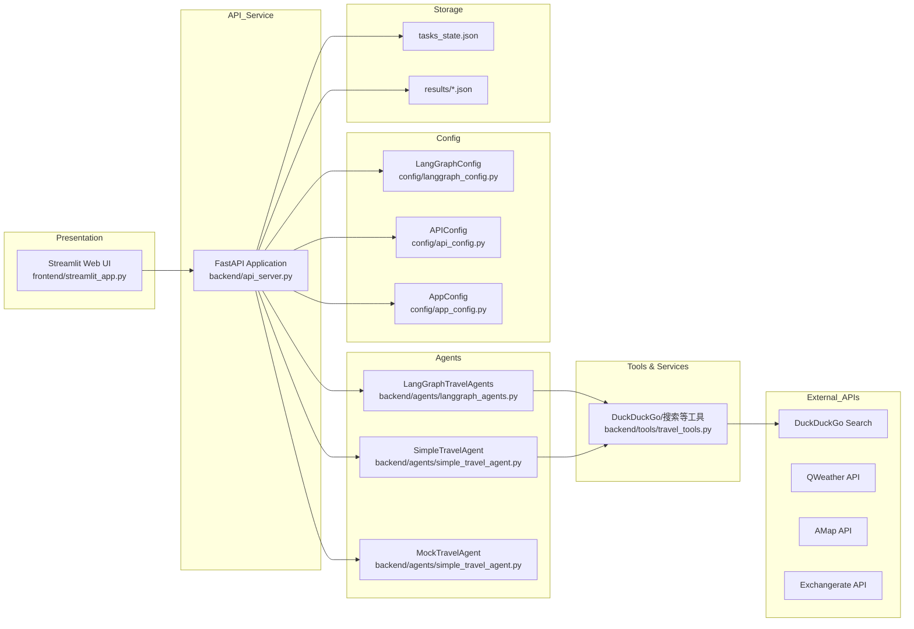
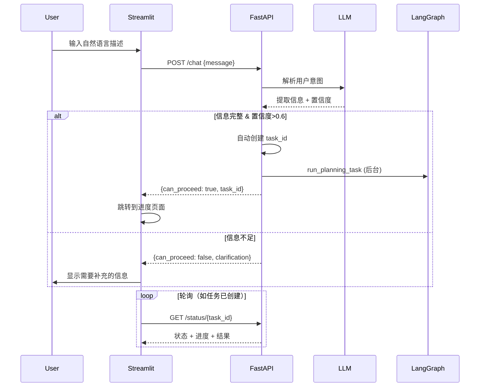
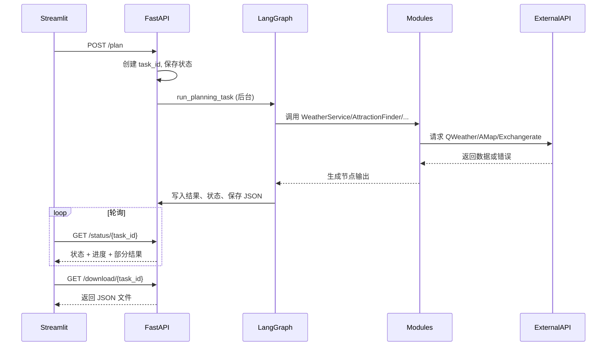
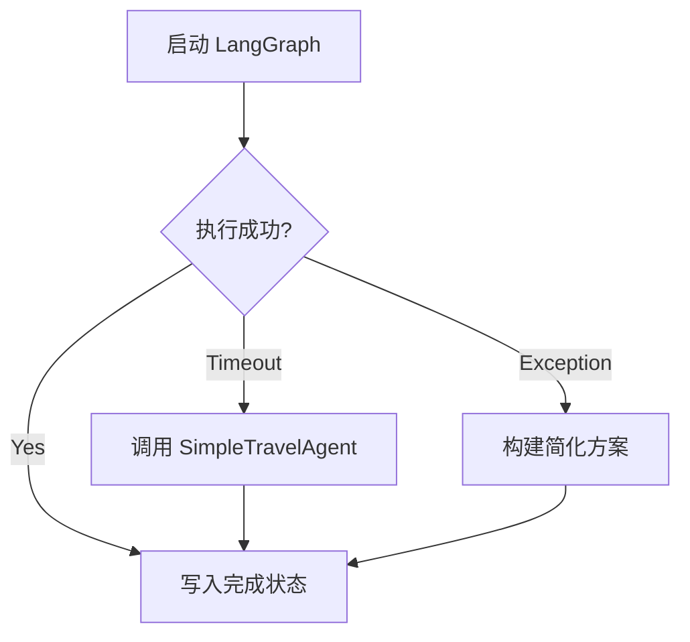

# AI 旅行规划智能体 - 系统设计文档

## 1. 架构目标
- 提供清晰的分层结构，支持多智能体协同、外部 API 集成以及前后端协作。
- 保证在企业环境中的可扩展性、可观测性和部署可移植性。

## 2. 总体架构

## 3. 模块视图

### 3.1 展示层（Streamlit）
- **职责**：界面表单收集、自然语言交互、任务轮询、结果展示与下载。
- **主要逻辑**：
  - `display_header()`, `display_agent_info()`：渲染页面结构。
  - **`display_chat_interface()`**：**自然语言交互界面**，提供大型文本输入框和快捷示例按钮。
  - 表单提交：调用 `/plan` 创建任务（传统表单模式）。
  - **聊天提交**：调用 `/chat` 进行自然语言解析与任务创建。
  - `poll_planning_status`：轮询 `GET /status/{task_id}`。
  - 下载按钮：请求 `/download/{task_id}`。
- **交互模式**：
  - **模式1：表单模式**（侧边栏）- 结构化输入，适合明确需求的用户。
  - **模式2：对话模式**（主界面）- 自然语言输入，适合快速表达想法的用户。

### 3.2 API 服务层（FastAPI）
- **核心文件**：`backend/api_server.py`。
- **职责**：
  - 定义 REST 接口 `/plan`、`/chat`、`/status/{task_id}`、`/download/{task_id}` 等。
  - 管理后台任务，维护 `planning_tasks` 状态字典。
  - 处理简化模式与模拟模式请求。
  - **自然语言解析与意图识别**。
- **关键逻辑**：
  - `run_planning_task`：异步执行 LangGraph 智能体，设定超时与回退。
  - **`chat_with_ai`**：**使用 LLM 解析自然语言输入，提取旅行信息，自动创建任务**。
  - `save_planning_result`：输出 JSON 报告至 `results/`。
  - `save_tasks_state`/`load_tasks_state`：持久化任务状态。

### 3.3 多智能体层
- **LangGraphTravelAgents**：
  - 使用 ChatOpenAI (`langchain_openai`)。
  - `StateGraph` 定义协调员（coordinator）和多个专家节点。
  - 每个节点函数负责更新状态中的 `messages`、`agent_outputs`。
  - 工具节点调用 `travel_tools.ALL_TOOLS`。
- **SimpleTravelAgent**：
  - 构建模板式提示词，快速生成基础行程。
- **MockTravelAgent**：
  - 返回固定格式结果，用于测试。

### 3.4 工具与外部服务
- 由 `backend/tools/travel_tools.py` 暴露的工具提供天气、景点、酒店、餐饮、预算等查询能力；
- 主要使用DuckDuckGo搜索获取实时信息，无需API密钥；
- 天气服务通过MCP服务器集成QWeather API，提供结构化天气数据；
- 所有工具在失败时提供回退逻辑，确保系统稳定性；
- 规划中的日程/总结/预算拆分由多智能体在对话与工具结果的基础上综合生成，不存在独立的 `backend/modules/*.py` 业务模块文件。

### 3.5 工具层
- `backend/tools/travel_tools.py` 提供多种搜索与查询工具（目的地、天气、景点、酒店、餐饮、预算等），供 LangGraph 工具节点调用。

### 3.6 配置与数据模型
- `backend/config/langgraph_config.py`：加载环境变量，提供 LLM 参数。
- `backend/config/api_config.py`：封装外部服务配置（QWeather、AMap、Exchangerate）。
- `backend/config/app_config.py`：系统默认值与限制。
- `backend/data/models.py`：定义实体 `Weather`、`Attraction`、`Hotel`、`DayPlan`、`TripSummary` 等。

## 4. 序列图

### 4.1 自然语言交互规划序列（新增）

### 4.2 表单模式规划序列（传统）

### 4.3 回退流程

## 5. 错误与回退策略
- **LangGraph 超时**：`asyncio.wait_for` 捕获，执行 `SimpleTravelAgent`，并保存快速模式计划。
- **模块异常**：各模块捕获异常，日志记录，并返回模拟数据（如 `_get_mock_attractions`）。
- **外部 API 不可达**：`currency_converter` 回退至缓存或 `fallback_rates`；`weather_service` 输出默认天气。
- **任务状态持久化失败**：打印日志，仅影响重启恢复，不影响当前执行。

## 6. 扩展点
- 可将 `tasks_state.json` 替换为 Redis/数据库，提高可靠性。
- LangGraph 节点可扩展，如加入"安全提醒"、"签证顾问"等。
- `travel_tools.ALL_TOOLS` 可扩展新的搜索工具或内部知识库。
- 前端可增加角色权限（策划师/审核员）和编辑功能。
- **自然语言交互可增强**：
  - 多轮对话支持（保存对话历史，逐步完善需求）；
  - 语音输入转文本；
  - 多语言支持（通过 LLM 自动翻译）；
  - 意图分类（规划、咨询、修改等）；
  - 情感分析优化用户体验。

## 7. 安全与合规
- 通过 `.env` 管理 API Key，禁止硬编码。
- 部署时使用 HTTPS，建议配合 API Gateway 做身份认证和流量控制。
- 对外展示需标注数据来源（高德、和风）。
- 符合企业数据治理：结果文件应存储在受控目录或对象存储，并设置生命周期策略。

## 8. 日志与监控建议
- 统一使用 Python logging 输出结构化日志（可扩展）。
- 关键指标：任务成功率、超时次数、外部 API 调用耗时。
- 建议接入 Prometheus / Grafana 或云端监控方案。

---

> 本系统设计文档结合项目代码提供模块化视图和流程说明，可作为开发、评审与后续扩展的参考。数据与业务细节请进一步参阅 `04_data_design.md` 与 `05_business_processes.md`。

