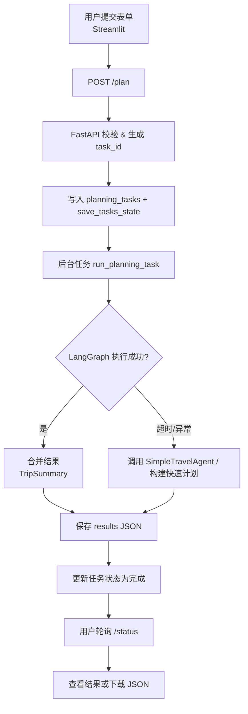
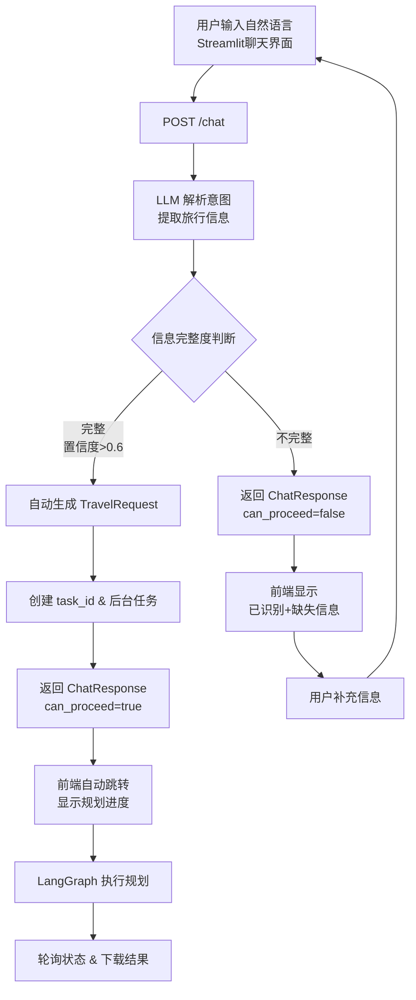
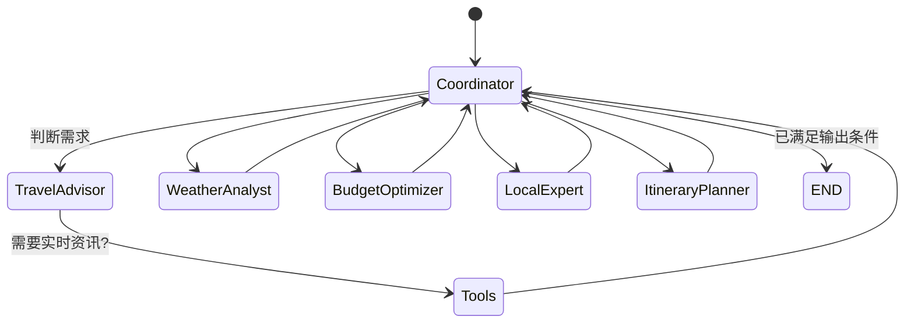
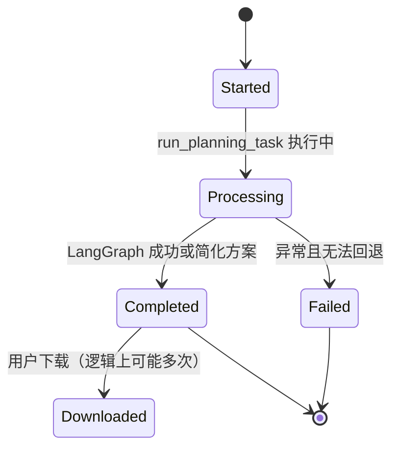
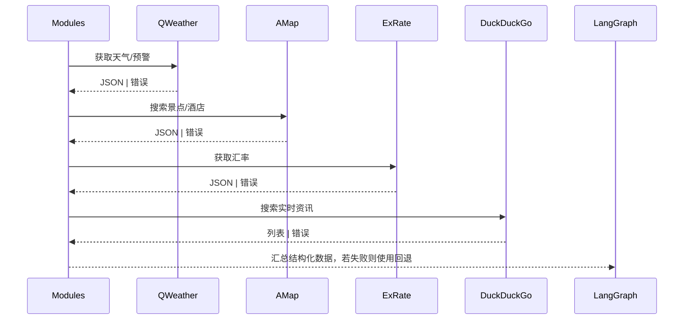
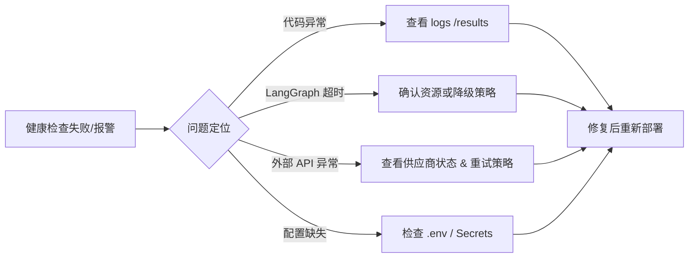

# AI 旅行规划智能体 - 关键业务流程文档

## 1. 旅行规划端到端流程

### 1.1 传统表单模式流程

### 1.2 自然语言交互模式流程（新增）

## 2. LangGraph 节点执行流程

## 3. 任务状态生命周期

## 4. 外部数据服务调用流程

## 5. 运维与异常处理流程

## 6. 运营关注流程
- **任务审计**：通过 `/tasks` 获取任务列表，筛选异常或长时间未完成的任务。
- **日志分析**：结合 Uvicorn/FastAPI 日志与结果文件，定位问题或优化内容。
- **人工干预**：若生成计划不符合客户需求，可根据 JSON 结果二次编辑或重新提交。
- **自然语言质量监控**：
  - 统计意图识别准确率（extracted vs. missing info）；
  - 分析常见失败模式，优化 LLM prompt；
  - 收集用户反馈，改进澄清问题的表达；
  - 监控自动创建任务的成功率与用户满意度。

## 7. SLA 与告警建议
- **SLA 指标**：
  - 任务成功率 ≥ 99%
  - 平均规划时长 ≤ 3 分钟
  - 超时回退比例 ≤ 5%
  - **自然语言意图识别准确率 ≥ 85%**
  - **自动创建任务成功率 ≥ 80%**
- **告警场景**：
  - `/health` 返回 warning/error。
  - 外部 API 连续 5 次失败。
  - 任务队列长度超过阈值（可通过 Redis/队列扩展实现）。
  - **LLM 解析连续失败 3 次以上**。
  - **意图识别置信度持续低于阈值**。

---

> 本文档面向运营、业务与技术团队，梳理旅行规划 Agent 在企业环境下的关键业务流程与异常处理路线。结合系统设计与部署文档，可构建完整的运维体系。

