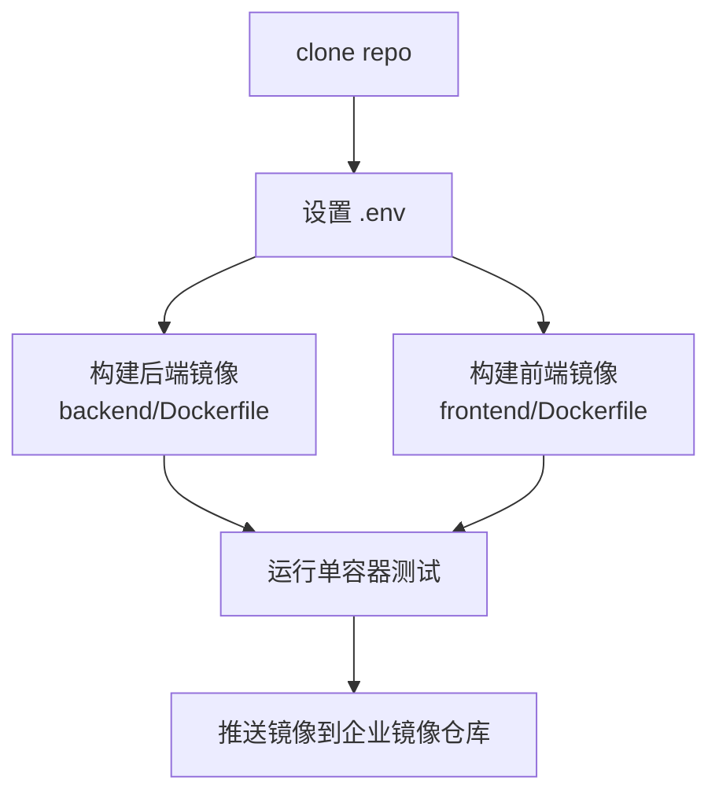
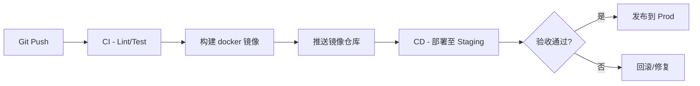

# AI 旅行规划智能体 - 部署与运维文档

## 1. 部署目标
- 在企业环境中实现可重复、可扩展的部署流程，覆盖 Dev/Staging/Prod 多环境。
- 支持容器化、CI/CD、日志与监控体系，确保服务稳定运行。

## 2. 环境规划
| 环境 | 用途 | 特点 |
| ---- | ---- | ---- |
| Dev | 开发调试 | 允许使用测试 Key，启用自动 reload（可选） |
| Staging | 预生产 | 使用与生产一致的配置，进行集成测试 |
| Prod | 生产 | 高可用部署，启用监控告警，受控访问 |

### 2.1 必备依赖
- Docker 20+
- Docker Compose v2
- Python 3.10（用于本地调试）
- 外部 API Key：`OPENAI_API_KEY`（必需）、`QWEATHER_API_KEY`（可选，用于MCP天气服务器）

## 3. 容器镜像构建


### 3.1 后端镜像（backend/Dockerfile）
1. 基于 `python:3.10-slim`。
2. 安装依赖、复制代码、创建 `results/`。
3. 暴露 8080 端口，设置健康检查（`/health`）。
4. 启动命令：`python api_server.py`。

### 3.2 前端镜像（frontend/Dockerfile）
1. 基于 `python:3.10-slim`。
2. 安装 Streamlit 依赖，复制代码。
3. 暴露 8501 端口，健康检查 `_stcore/health`。
4. 启动命令：`streamlit run streamlit_app.py --server.address 0.0.0.0`。

## 4. Docker Compose 部署
```yaml
services:
  backend:
    build:
      context: ./backend
    environment:
      - OPENAI_API_KEY=${OPENAI_API_KEY}
      - QWEATHER_API_KEY=${QWEATHER_API_KEY}
    volumes:
      - ./results:/app/results
    ports:
      - "8080:8080"
    healthcheck:
      test: ["CMD", "curl", "-f", "http://localhost:8080/health"]
  frontend:
    build:
      context: ./frontend
    environment:
      - API_BASE_URL=http://backend:8080
    ports:
      - "8501:8501"
    depends_on:
      backend:
        condition: service_healthy
```

### 4.1 启动命令
```bash
docker compose up --build
```
后台运行：
```bash
docker compose up -d --build
```

### 4.2 健康检查
- 后端：`http://localhost:8080/health`
- 后端 API 文档：`http://localhost:8080/docs`
- 前端页面：`http://localhost:8501`

## 5. CI/CD 流程建议


### 5.1 推荐实践
- 使用 GitHub Actions / GitLab CI：
  - 步骤：Checkout → 安装依赖 → 单元测试 → `docker build` → 推送镜像。
- 生产部署可使用 Argo CD、Flux 或企业内部发布平台。

## 6. 配置与 secrets 管理
- `.env` 仅用于本地开发；生产环境通过 Secrets Manager（如 AWS Secrets Manager、Vault）或 CI/CD 注入环境变量。
- `QWEATHER_API_KEY` 示例：从和风天气开放平台获取，用于MCP天气服务器提供结构化天气数据。
- 注意高德和和风天气 API 的调用频率与额度，必要时配置熔断与重试。

## 7. 日志与监控
### 7.1 日志
- 默认使用标准输出，建议使用结构化日志并接入 ELK/EFK。
- 建议日志内容：task_id、状态变更、外部 API 调用耗时、异常信息。

### 7.2 指标与告警
- 关键指标：
  - 请求成功率、错误率
  - LangGraph 执行时间、超时次数
  - 外部 API 调用成功率
  - 任务队列长度、等待时间
- 监控方案：
  - Prometheus + Grafana
  - CloudWatch（云部署）

## 8. 安全与合规
- 前端/后端通过 HTTPS 对外发布，可置于 API Gateway 之后做 IP 白名单与速率限制。
- 外部 API Key 最小化权限管理，周期性轮换。
- 数据存储：
  - `results/` 默认写入本地，可替换为共享存储或对象存储。
  - 保存周期根据企业政策设置生命周期策略。
- 安全扫描：构建时执行 SAST/DAST（如 Bandit、Trivy）。

## 9. 运维操作指南
| 操作 | 命令/步骤 |
| ---- | -------- |
| 查看容器日志 | `docker compose logs -f backend` / `frontend` |
| 重启服务 | `docker compose restart backend frontend` |
| 更新代码部署 | `git pull` → `docker compose build --no-cache` → `docker compose up -d` |
| 清理任务状态 | 删除或备份 `backend/tasks_state.json`（生产建议迁移至数据库） |
| 清理结果文件 | 定期清理 `results/`，可配合 crontab 或对象存储生命周期 |

## 10. 灾备方案
- 建议在生产环境部署至少两份后端实例（使用负载均衡或 K8s）。
- 将任务状态迁移到 Redis/PostgreSQL，避免单实例重启导致状态丢失。
- 对外部 API 加入重试与熔断逻辑，必要时提供人工审批流程。

---

> 本部署与运维文档旨在为企业提供标准化上线方案。结合前面的需求、设计、数据与流程文档，可构建完整的 DevOps 生命周期。必要时可与企业现有监控、日志、CI/CD 平台对接，提升可观测性与稳定性。

