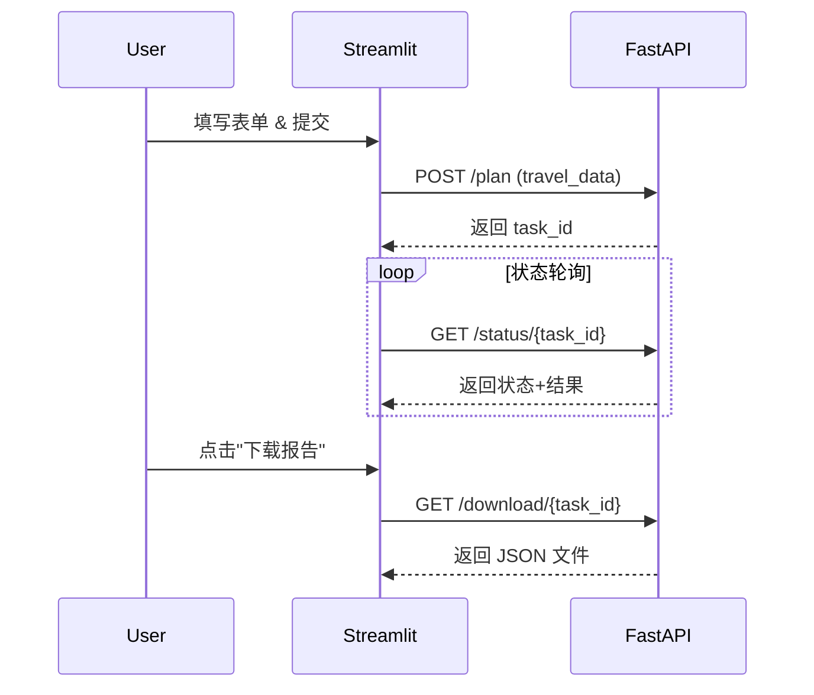
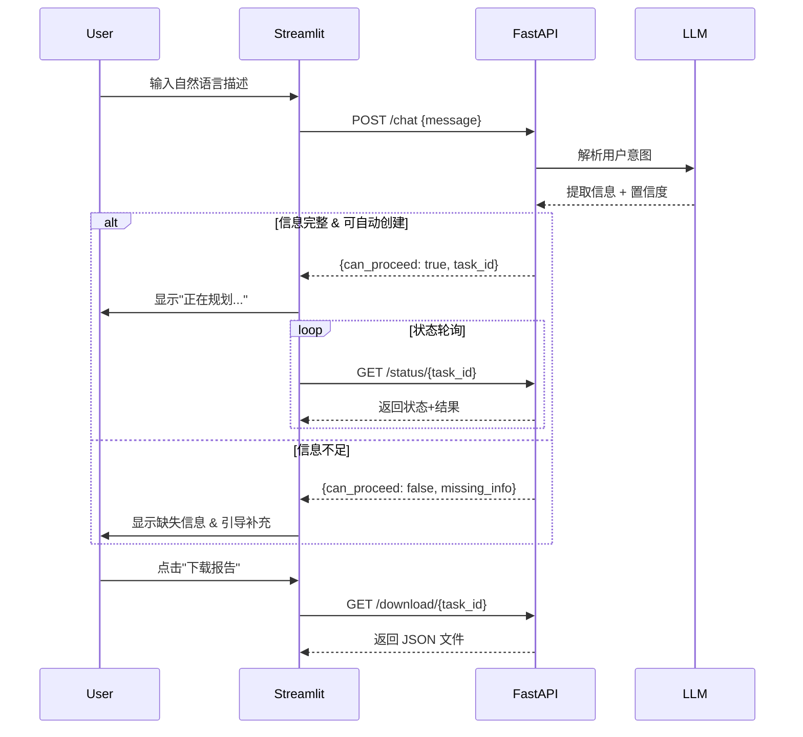

# Streamlit 前端接口调用说明

## 1. 概述
本说明文档梳理 `frontend/streamlit_app.py` 中前端页面调用后端服务的接口，便于企业在生产环境中审计与监控。

## 2. 接口列表
| 前端函数 | 后端接口 | HTTP 方法 | 说明 |
| -------- | -------- | -------- | ---- |
| `check_api_health` | `/health` | GET | 检查后端服务状态，返回配置信息与系统资源。 |
| `create_travel_plan` | `/plan` | POST | （表单方式）创建旅行规划任务，返回 `task_id`。 |
| **`display_chat_interface`** | **`/chat`** | **POST** | **（自然语言方式）解析用户输入，自动创建旅行规划任务，返回 `ChatResponse`。** |
| `get_planning_status` | `/status/{task_id}` | GET | 查询规划任务进度与结果。 |
| `download_travel_plan` | `/download/{task_id}` | GET | 下载规划结果 JSON 文件（用于前端"下载报告"按钮）。 |
| `list_tasks` *(可选调用)* | `/tasks` | GET | 列出所有任务概览，默认界面未直接调用，可用于运营视图。 |

> 注：`/simple-plan` 与 `/mock-plan` 由后端提供（见 `backend/api_server.py`），可按需在前端新增按钮接入；当前界面默认使用主规划流程。

## 3. 调用流程

### 3.1 传统表单模式


### 3.2 自然语言交互模式（新增）


## 4. 调用细节
### 4.1 `/health`
- **函数**：`check_api_health`
- **触发时机**：页面加载时自动调用。
- **超时处理**：15 秒超时；若失败显示错误提示。
- **返回示例**：
  ```json
  {
    "status": "healthy",
    "llm_model": "deepseek-chat",
    "api_key_configured": true,
    "system_info": {
      "cpu_usage": "5%",
      "memory_usage": "42%"
    }
  }
  ```

### 4.2 `/plan`（表单模式）
- **函数**：`create_travel_plan`
- **输入数据**：`TravelRequest`（目的地、日期、预算、兴趣等）。
- **超时策略**：60 秒；失败提示重试或检查后端。
- **返回示例**：`{"task_id": "uuid...", "status": "started"}`

### 4.3 `/chat`（自然语言模式 - 新增）
- **函数**：`display_chat_interface`（前端）调用后端 `/chat` 接口
- **输入数据**：`ChatRequest`
  ```json
  {
    "message": "我想下周去北京玩3天，预算3000元，喜欢历史文化"
  }
  ```
- **后端处理流程**：
  1. 使用 LLM（ChatOpenAI）解析自然语言；
  2. 提取结构化信息（destination, dates, budget, interests）；
  3. 判断信息完整度和置信度；
  4. 如果可以创建任务，自动生成 `task_id` 并启动后台规划；
  5. 如果信息不足，返回缺失信息列表。
- **超时策略**：30 秒；LLM 解析失败时返回友好错误提示。
- **响应示例**（信息完整）：
  ```json
  {
    "understood": true,
    "extracted_info": {
      "destination": "北京",
      "duration": 3,
      "budget_range": "中等预算",
      "interests": ["历史文化"]
    },
    "missing_info": [],
    "clarification": "✅ 好的！旅小智已经理解您的需求，正在为您规划北京之旅！\n\n📋 规划信息：\n📍 目的地：北京\n⏰ 天数：3天\n💰 预算：中等预算\n🎯 兴趣：历史文化\n\n🤖 AI智能体团队正在为您工作，请稍候...",
    "can_proceed": true,
    "task_id": "uuid-12345..."
  }
  ```
- **响应示例**（信息不足）：
  ```json
  {
    "understood": true,
    "extracted_info": {
      "destination": "北京"
    },
    "missing_info": ["时间信息", "预算", "人数"],
    "clarification": "好的！您想去北京旅行。\n\n请问您计划什么时候出发？大概玩几天呢？\n\n💡 还需要了解：时间信息, 预算, 人数",
    "can_proceed": false,
    "task_id": null
  }
  ```
- **前端交互**：
  - 用户输入自然语言，点击"发送"或快捷示例按钮；
  - 显示 Loading 状态"🤖 旅小智正在理解您的需求..."；
  - 如果 `can_proceed=true`，自动跳转到规划进度页面；
  - 如果 `can_proceed=false`，显示已识别和缺失的信息，引导用户补充。
- **用户体验优化**：
  - 提供快捷示例（"北京3日游"、"杭州周末游"等）；
  - 400px 高度的大型输入框；
  - 实时显示 AI 理解的内容；
  - 友好的反馈文案（emoji + 清晰表达）。

### 4.4 `/status/{task_id}`
- **函数**：`get_planning_status`
- **轮询策略**：最大重试 3 次，每次超时重试等待 1~2 秒。
- **响应字段**：
  - `status`: started/processing/completed/failed
  - `progress`: 0-100
  - `current_agent`: 当前执行节点描述
  - `message`: 当前提示信息
  - `result`: 最终结果（完成后提供）

### 4.5 `/download/{task_id}`
- **触发**：用户点击“下载报告”按钮。
- **返回**：JSON 文件，包含任务请求、执行时间和规划结果。
- **存储**：文件默认位于后端 `results/` 目录。

## 5. 扩展接口
如需在前端集成简化版或模拟版规划，可在界面上添加按钮调用：
- `POST /simple-plan`
- `POST /mock-plan`

调用方式可复用 `requests.post`，并在页面中展示返回结果或提示。

## 6. 监控与日志建议
- 在前端记录每次接口调用的耗时和状态码，便于用户反馈时排查。
- 后端应对 `/plan`、`/chat`、`/status`、`/download` 添加日志（task_id、耗时、错误信息）。
- 在生产环境中，可使用 API Gateway 或 APM（如 Datadog、New Relic）监控接口调用频次与失败率。
- **自然语言交互监控**：
  - 记录每次意图解析的输入、输出和置信度；
  - 统计自动创建任务的成功率；
  - 分析常见的缺失信息模式，优化提示词；
  - 监控 LLM 调用耗时和失败率；
  - 收集用户对澄清问题的反馈（是否有助于补充信息）。

---

> 本文档适用于企业运维/前端团队了解前端与后端的接口交互，便于上线前的验证与后续的监控。必要时可进一步扩展为 Swagger 文档或 Postman Collection。
