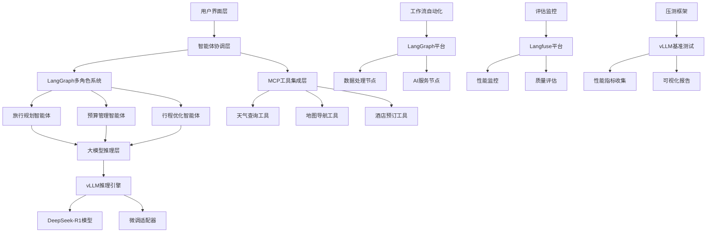

# Agentic AI 智能体开发实战

<div align="center">


**企业级AI智能体实战课程 · 6个完整项目 · 从底层原理到生产部署**

[课程定位](#-课程定位) • [实战项目](#-六大实战项目) • [技术栈](#-技术栈) • [快速开始](#-快速开始) • [环境搭建](#-环境搭建)

</div>

---

## 📚 课程定位

### 🎯 课程目标

**面向大模型智能体中高级学习者的系统化实战课程**，通过6个完整的企业级项目，掌握从底层原理到生产部署的全链路技能。本课程不是入门教程，而是帮助你构建**可落地、可扩展、可维护**的智能体系统。

### 👥 适合人群

| 学习者类型 | 技术背景 | 学习目标 | 预期收获 |
|---------|----------|----------|----------|
| **AI工程师** | 有Python基础，了解大模型API调用 | 掌握智能体系统架构设计与实现 | 独立构建企业级智能体应用 |
| **后端开发者** | 熟悉FastAPI/Django等Web框架 | 转型AI应用开发 | 掌握AI工具链集成与部署 |
| **算法工程师** | 有深度学习基础，想做应用落地 | 学习模型微调与推理优化 | 将研究成果工程化落地 |
| **技术Leader** | 负责AI项目架构设计 | 了解完整技术栈和优秀做法 | 制定团队技术路线和规范 |

### 💡 课程特色

- **🔬 深度实战**：6个完整项目，涵盖从原理到部署的全流程
- **🏗️ 底层理解**：不只用框架，更要理解Agent底层工作原理（GAME框架）
- **📊 企业级**：包含监控、评估、优化、部署等生产环境必备能力
- **🎯 垂直场景**：医疗、旅游等真实行业应用案例
- **⚡ 性能优化**：涵盖模型微调、推理加速、成本优化等高级主题

---

## 🎯 六大实战项目

### 项目概览

每个项目都是**完整可运行**的企业级应用，包含从需求分析到生产部署的全流程。

| # | 项目名称 | 技术栈 | 难度 |
|---|---------|--------|------|
| 1️⃣ | [MCP工具集成](#项目2mcp工具集成--和风天气) | MCP + DeepSeek + FastMCP | ⭐⭐⭐ | 
| 2️⃣ | [从零构建智能体框架](#项目1从零构建智能体框架) | OpenAI API + GAME架构 | ⭐⭐⭐⭐ |
| 3️⃣ | [深度研究助手](#项目3深度研究助手) | LangGraph + Tavily Search | ⭐⭐⭐⭐ | 
| 4️⃣ | [多角色旅行规划系统](#项目4多角色旅行规划智能体) | LangGraph + Docker + Streamlit | ⭐⭐⭐⭐⭐ |
| 5️⃣ | [智能体监控评估](#项目5智能体监控与评估) | Langfuse + LangSmith | ⭐⭐⭐⭐ |
| 6️⃣ | [医疗领域模型微调](#项目6医疗领域模型微调) | LlamaFactory + vLLM + LoRA | ⭐⭐⭐⭐⭐ |

---
### 项目1：MCP工具集成 · 和风天气

**🎯 项目目标**：基于Model Context Protocol实现智能体与外部工具的标准化集成。

**📂 代码位置**：`01-agent-tool-mcp/mcp-demo/`

**🔑 核心知识点**：
- MCP协议原理与规范（Resources/Tools/Prompts）
- 客户端-服务器架构设计
- 异步工具调用与并发处理
- 工具Schema定义与验证
- 多轮对话与工具链路管理

**💡 实战产出**：
```bash
# 完整的MCP天气服务
weather_server.py       # MCP服务端（FastMCP）
mcp_client_deepseek.py  # 集成DeepSeek的客户端
- get_weather_warning   # 获取天气预警
- get_daily_forecast    # 获取天气预报
```

**🎓 学习价值**：
- ✅ 掌握MCP协议，接入任意第三方工具
- ✅ 学习异步编程与错误重试机制
- ✅ 理解工具调用的完整生命周期

---

### 项目2：从零构建智能体框架

**🎯 项目目标**：不使用任何框架，从零实现一个完整的智能体系统，深入理解Agent工作原理。

**📂 代码位置**：`01-agent-tool-mcp/ASimpleAgentFramework.ipynb`

**🔑 核心知识点**：
- GAME架构设计（Goals/Actions/Memory/Environment）
- OpenAI Function Calling原理与实现
- Agent主循环（Prompt构造 → LLM决策 → 工具执行 → 记忆更新）
- 工具注册与动态调用机制
- 错误处理与异常捕获

**💡 实战产出**：
```python
# 你将实现的核心组件
- Goal: 目标定义系统
- Action: 工具注册与执行
- Memory: 对话历史管理
- Environment: 工具执行环境
- AgentLanguage: Prompt格式化与解析
- Agent: 主循环协调器
```

**🎓 学习价值**：
- ✅ 理解智能体的本质：LLM + 工具调用 + 记忆系统
- ✅ 掌握如何设计可扩展的Agent架构
- ✅ 为学习LangChain/LangGraph等框架打下基础

---

### 项目3：深度研究助手

**🎯 项目目标**：构建一个能够自主进行深度研究的智能体，集成搜索引擎并生成结构化报告。

**📂 代码位置**：`02-agent-multi-role/deepresearch/`

**🔑 核心知识点**：
- LangGraph图状态机设计
- 多步骤工作流编排
- 搜索引擎集成（Tavily API）
- 信息提取与结构化
- LangGraph Studio可视化调试

**💡 实战产出**：
```python
# 研究助手工作流
用户查询 → 分析意图 → 搜索信息 → 深度分析 → 生成报告
- 自动拆解复杂问题
- 多轮搜索与信息整合
- Markdown格式报告生成
```

**🎓 学习价值**：
- ✅ 掌握LangGraph状态机编排
- ✅ 学习如何设计复杂工作流
- ✅ 理解ReAct模式在研究场景的应用

---

### 项目4：多角色旅行规划智能体

**🎯 项目目标**：构建企业级的多智能体协作系统，包含完整的前后端和容器化部署。

**📂 代码位置**：`03-agent-build-docker-deploy/`

**🔑 核心知识点**：
- 多智能体协作架构（需求分析/行程规划/预算管理/偏好学习/协调调度）
- LangGraph多角色State管理
- FastAPI后端服务开发
- Streamlit前端界面构建
- Docker多容器编排
- 生产环境配置管理

**💡 实战产出**：
```
前端：Streamlit Web界面
后端：FastAPI服务 + LangGraph智能体
部署：Docker Compose一键启动
功能：
  - 自然语言旅行规划
  - 多智能体协作决策
  - 实时天气查询
  - 个性化推荐
  - 预算优化
```

**🎓 学习价值**：
- ✅ 掌握企业级智能体系统架构
- ✅ 学习前后端分离与API设计
- ✅ 理解多智能体协作模式
- ✅ 掌握Docker容器化部署

---

### 项目5：智能体监控与评估

**🎯 项目目标**：建立完整的智能体质量评估和性能监控体系。

**📂 代码位置**：`04-agent-evaluation/langfuse/03_example_langgraph_agents.ipynb`

**🔑 核心知识点**：
- Langfuse追踪与监控集成
- 调试工具使用
- 智能体评估指标设计（准确性/完整性/安全性）
- 自动化评估流程
- 成本分析与优化

**💡 实战产出**：
```python
# 评估体系
- 实时追踪：每次调用的完整链路
- 性能监控：延迟、Token消耗、成本
- 质量评估：自动化测试用例
- 安全检测：敏感信息过滤、越狱检测
- 可视化：Dashboard展示
```

**🎓 学习价值**：
- ✅ 掌握生产环境监控优秀做法
- ✅ 学习如何评估智能体质量
- ✅ 理解成本优化策略

---

### 项目6：医疗领域模型微调

**🎯 项目目标**：针对医疗垂直领域进行模型微调，包含数据集构建、LoRA微调、推理部署全流程。

**📂 代码位置**：`05-agent-model-finetuning/llamafactory/`

**🔑 核心知识点**：
- 领域数据集构建（Alpaca/ShareGPT格式）
- LlamaFactory微调框架使用
- LoRA/QLoRA参数高效微调
- vLLM推理部署
- 模型评估与对比
- 显存优化技巧

**💡 实战产出**：
```bash
# 完整微调流程
dataset/              # 医疗领域数据集
  - MedicalData-2025/
  - alpaca.json       # 微调数据
  - dataset_info.json # 数据集配置

configs/              # 微调配置
  - llamafactory-*.yaml    # LlamaFactory配置

lora/                 # LoRA适配器
  - 微调后的模型权重

inference/            # 推理服务
  - vLLM部署脚本
```

**🎓 学习价值**：
- ✅ 掌握领域模型微调完整流程
- ✅ 学习数据工程与质量控制
- ✅ 理解LoRA原理与参数选择
- ✅ 掌握推理服务部署与优化

---

### 🏆 学习收获

| 维度 | 具体能力 |
|------|---------|
| **🧠 架构能力** | 从零设计智能体系统架构，理解GAME/ReAct等核心范式 |
| **🔧 工程能力** | 掌握MCP协议、Docker部署、前后端集成等工程技能 |
| **📊 优化能力** | 监控评估、成本优化、推理加速、模型微调 |
| **🎯 落地能力** | 6个完整项目经验，可直接应用于实际业务 |
| **💼 求职优势** | 企业级项目经验，覆盖智能体开发全栈技能 |

---

## 📖 课程大纲

### 模块一：智能体基础与工具集成

**🎯 学习目标**：理解智能体底层原理，掌握工具集成方法

| 课程 | 内容 | 代码位置 |
|------|------|----------|
| **智能体的工具调用** | 工具链路、并发调用、错误处理 | `01-agent-tool-mcp/tool-use/` |
| **MCP协议集成** | MCP服务端/客户端开发 + 和风天气案例 | `01-agent-tool-mcp/mcp-demo/` |
| **从零构建智能体** | GAME架构 + OpenAI Function Calling | `01-agent-tool-mcp/ASimpleAgentFramework.ipynb` |


---

### 模块二：多角色智能体系统

**🎯 学习目标**：掌握LangGraph框架，构建复杂工作流

| 课程 | 内容 | 代码位置 |
|------|------|----------|
| **LangGraph基础** | 状态机、路由、记忆管理 | `02-agent-multi-role/langgraph/1-Base/` |
| **LangGraph进阶** | 断点调试、时光旅行、子图编排 | `02-agent-multi-role/langgraph/2-Advance/` |
| **深度研究助手** | 完整项目：搜索集成 + 报告生成 | `02-agent-multi-role/deepresearch/` |

---

### 模块三：企业级系统搭建与部署

**🎯 学习目标**：构建生产级智能体应用

| 课程 | 内容 | 代码位置 |
|------|------|----------|
| **多角色协作** | 旅行规划智能体（5个专业角色） | `03-agent-build-docker-deploy/backend/agents/` |
| **前后端开发** | FastAPI + Streamlit | `03-agent-build-docker-deploy/` |
| **容器化部署** | Docker Compose一键部署 | `03-agent-build-docker-deploy/docker-compose.yml` |

---

### 模块四：监控、评估与优化

**🎯 学习目标**：建立质量保障体系

| 课程 | 内容 | 代码位置 |
|------|------|----------|
| **Langfuse集成** | 追踪、监控、成本分析 | `04-agent-evaluation/langfuse/01_*.ipynb` |
| **自动化评估** | LLM评估、安全检测 | `04-agent-evaluation/langfuse/02_*.ipynb` |
| **完整案例** | 旅行智能体评估体系 | `04-agent-evaluation/langfuse/03_*.ipynb` |

---

### 模块五：模型微调与推理优化

**🎯 学习目标**：掌握垂直领域模型定制

| 课程 | 内容 | 代码位置 |
|------|------|----------|
| **数据集构建** | 医疗领域数据工程 | `05-agent-model-finetuning/llamafactory/01-llm-fine-tuning/dataset/` |
| **LoRA微调** | LlamaFactory微调实战 | `05-agent-model-finetuning/llamafactory/01-llm-fine-tuning/` |
| **推理部署** | vLLM高性能推理 | `05-agent-model-finetuning/llamafactory/02-llm-inference/` |

---

## 🛠️ 技术栈

> 📋 **版本信息参考**:
> - 🚀 [版本快速参考](./docs/版本快速参考.md) - 核心版本一览表和快速安装命令
> - 📖 [完整版本依赖清单](./docs/版本依赖清单.md) - 所有组件的详细版本信息、说明和安装指南

### 🏗️ 系统架构图



### 🔧 核心技术组件

| 技术领域 | 核心技术 | 版本 | 应用场景 |
|---------|----------|------|----------|
| **🧠 大语言模型** | OpenAI/DeepSeek/Anthropic | GPT-4/DeepSeek-R1/Claude | 核心推理引擎 |
| **🐍 Python环境** | Python | 3.10.18 | 开发运行环境 |
| **🐍 包管理器** | Conda/Miniconda | 24.4.0 | Python环境管理 |
| **🔗 LangChain生态** | langchain | 1.1.3  / 0.3.27 | 大语言模型应用框架 |
| **🔗 LangChain核心** | langchain-core | 1.1.3  / 0.3.75 | LangChain基础抽象层 |
| **🔗 LangChain社区** | langchain-community | 0.4.1  / 0.3.27 | 第三方集成工具集 |
| **🔗 LangChain OpenAI** | langchain-openai | 1.1.1  / 0.3.31 | OpenAI接口适配器 |
| **🔄 LangGraph** | langgraph | 1.0.4  / 0.6.7 | 多智能体工作流编排 |
| **🔄 LangGraph预构建** | langgraph-prebuilt | 1.0.5  | 预构建智能体组件 |
| **🔄 LangGraph检查点** | langgraph-checkpoint-sqlite | 3.0.1  | SQLite状态持久化 |
| **🔄 LangGraph CLI** | langgraph-cli | 0.4.9  | 命令行工具集 |
| **🔄 LangGraph SDK** | langgraph-sdk | 0.2.15  | SDK开发工具包 |
| **🌐 MCP协议** | mcp | 1.17.0 | 模型上下文工具集成 |
| **🌐 MCP适配器** | langchain-mcp-adapters | 0.1.11 | LangChain MCP集成 |
| **📡 OpenAI SDK** | openai | 1.107.0 | OpenAI官方SDK |
| **🤖 Transformers** | transformers | 4.45.0 | HuggingFace模型库 |
| **🚀 Web框架** | fastapi | 0.116.1  | 高性能API服务 |
| **🚀 Web服务器** | uvicorn | 0.35.0  | 异步ASGI服务器 |
| **📊 数据处理** | pandas | 2.2.2 | 数据分析处理 |
| **📊 数值计算** | numpy | 1.25.0 | 科学计算库 |
| **✅ 数据验证** | pydantic | 2.11.9  | 数据模型验证 |
| **🌐 HTTP客户端** | httpx | 0.28.1 | 异步HTTP请求 |
| **🌐 HTTP库** | requests | 2.32.5  | 同步HTTP请求 |
| **🔍 网页解析** | beautifulsoup4 | 4.14.3  | HTML/XML解析 |
| **🔍 网络搜索** | duckduckgo-search | 8.1.1 | 隐私搜索引擎 |
| **🔍 AI搜索** | tavily-python | 0.7.14  | AI驱动的实时搜索 |
| **📚 知识库** | wikipedia | 1.4.0 | Wikipedia数据访问 |
| **📦 环境管理** | python-dotenv | 1.1.1  | 环境变量管理 |
| **🧪 测试框架** | pytest | 8.4.1  | 单元测试工具 |
| **📊 监控平台** | Langfuse | 3.3.0 | 性能监控与评估 |
| **🎯 数据集工具** | Easy Dataset | 1.6.1 | 数据集处理工具 |
| **🎯 微调框架** | LLaMA Factory | v0.9.3 | 模型个性化微调 |
| **⚡ 推理引擎** | vLLM | 0.8.5 | 高性能模型推理 |
| **🐳 容器化** | Docker | 28.4.0 | 容器化部署 |
| **🐳 容器编排** | Docker Compose | v2.39.4 | 多容器管理 |


## 🚀 快速开始

### ⚡ 5分钟快速体验

#### 🌤️ 体验项目1：MCP工具集成

```bash
# 1. 进入MCP演示目录
cd 01-agent-tool-mcp/mcp-demo

# 2. 安装依赖
pip install -r requirements.txt

# 3. 配置环境变量
cp env.example .env
# 编辑.env文件，填入API密钥

# 4. 启动MCP服务器（新终端）
python server/weather_server.py

# 5. 运行客户端
python client/mcp_client_deepseek.py
```

**🎉 预期效果**：
```
请输入你的问题: 北京今天天气怎么样？
助手: 今天北京天气晴朗，最低10°C，最高25°C...
```

---

#### 🎯 体验项目2：从零构建智能体

```bash
# 1. 打开Jupyter Notebook
jupyter notebook 01-agent-tool-mcp/ASimpleAgentFramework.ipynb

# 2. 配置OpenAI API密钥（在notebook中）
OPENAI_API_KEY=sk-your-openai-api-key
OPENAI_BASE_URL=https://api.openai.com/v1

# 3. 运行所有单元格
# 观察GAME框架如何工作：Goals → Actions → Memory → Environment
```

**🎉 预期效果**：智能体会自动列出项目文件、读取内容并生成README

---

#### 🔍 体验项目3：深度研究助手

```bash
# 1. 进入LangGraph目录
cd 02-agent-multi-role/deepresearch

# 2. 启动LangGraph Studio
langgraph dev

# 3. 在浏览器打开
# https://smith.langchain.com/studio

# 4. 可视化调试智能体工作流
```

**🎉 预期效果**：看到智能体的完整思考过程和工具调用链路

---

#### 🏨 体验项目4：旅行规划系统

```bash
# 1. 进入部署目录
cd 03-agent-build-docker-deploy

# 2. 配置环境
cp backend/env.example backend/.env
# 编辑.env文件

# 3. 一键启动（Docker方式）
docker-compose up -d

# 4. 访问Web界面
# http://localhost:8501
```

**🎉 预期效果**：完整的多角色智能体协作系统，生成旅行规划报告

---

### 📚 学习路径建议

| 学习阶段 | 推荐顺序 | 学习重点 | 时间投入 |
|---------|---------|---------|---------|
| **🟢 入门阶段** | 项目1 → 项目2 | 理解Agent原理、掌握工具集成 | 1-2周 |
| **🟡 进阶阶段** | 项目3 → 项目4 | LangGraph框架、多角色协作 | 2-3周 |
| **🔴 高级阶段** | 项目5 → 项目6 | 监控评估、模型微调 | 2-3周 |

---

### 🎯 学习目标检查清单

#### ✅ 基础能力（完成项目1-2）
- [ ] 理解智能体的GAME架构
- [ ] 掌握OpenAI Function Calling
- [ ] 熟悉MCP协议和工具集成
- [ ] 能够处理异步调用和错误重试

#### ✅ 进阶能力（完成项目3-4）
- [ ] 掌握LangGraph状态机设计
- [ ] 实现多智能体协作系统
- [ ] 能够开发前后端分离应用
- [ ] 掌握Docker容器化部署

#### ✅ 高级能力（完成项目5-6）
- [ ] 建立完整的监控评估体系
- [ ] 掌握模型微调与优化
- [ ] 理解推理服务部署
- [ ] 具备成本优化能力


---

## 📁 项目结构

```
Agent_In_Action/
├── 01-agent-tool-mcp/                      # 【项目1-2】智能体基础与MCP集成
│   ├── ASimpleAgentFramework.ipynb        # 从零构建智能体（GAME框架）
│   ├── mcp-demo/                          # MCP工具集成 - 和风天气
│   │   ├── server/weather_server.py       # MCP服务端
│   │   └── client/mcp_client_deepseek.py  # MCP客户端
│   └── tool-use/                          # 工具调用进阶示例
│
├── 02-agent-multi-role/                   # 【项目3】多角色智能体
│   ├── deepresearch/                      # 深度研究助手（完整项目）
│   │   ├── deployment/                    # 部署配置
│   │   └── *.ipynb                        # 实战案例
│   └── langgraph/                         # LangGraph学习路径
│       ├── 1-Base/                        # 基础：状态机、路由、记忆
│       └── 2-Advance/                     # 进阶：断点、时光旅行、子图
│
├── 03-agent-build-docker-deploy/         # 【项目4】旅行规划系统
│   ├── backend/                           # FastAPI后端
│   │   ├── agents/                        # 多角色智能体实现
│   │   ├── tools/                         # 工具集成（天气、搜索等）
│   │   └── api_server.py                  # API服务
│   ├── frontend/                          # Streamlit前端
│   │   └── streamlit_app.py
│   ├── docker-compose.yml                 # 一键部署配置
│   └── docs/                              # 架构文档与教程
│
├── 04-agent-evaluation/                   # 【项目5】监控与评估
│   └── langfuse/                          # Langfuse完整教程
│       ├── 01_*_integration_*.ipynb       # SDK集成（OpenAI/LangChain/LangGraph）
│       ├── 02_evaluation_*.ipynb          # 自动化评估
│       ├── 03_example_*.ipynb             # 完整项目案例
│       └── 04_example_*.ipynb             # 安全监控案例
│
├── 05-agent-model-finetuning/            # 【项目6】医疗模型微调
│   └── llamafactory/                      # LlamaFactory完整流程
│       ├── 00-docs/                       # 技术文档
│       ├── 01-llm-fine-tuning/            # 微调实战
│       │   ├── dataset/                   # 医疗数据集
│       │   ├── configs/                   # 微调配置
│       │   └── lora/                      # LoRA适配器
│       └── 02-llm-inference/              # vLLM推理部署
│
└── README.md                              # 本文档
```

**💡 学习建议**：
- 🟢 **新手**：按项目1→2→3顺序学习
- 🟡 **进阶**：重点学习项目3→4→5
- 🔴 **高级**：深入研究项目5→6

---

## 🛠️ 环境搭建

> 📖 **完整环境搭建指南**：[AI Agent 101 环境搭建完整指南](./docs/AI_Agent_101_环境搭建完整指南.md)

### 🎯 两种方式快速开始

#### 方式一：使用预配置虚拟机（⚡最快，推荐新手）

直接导入已配置好所有环境的虚拟机镜像（OVF 格式），开箱即用！

```bash
# 1. 下载虚拟机镜像
链接: https://pan.baidu.com/s/1sAtxJABh2fM_c8_D9mIdow 
提取码: 1234

# 2. 导入到 VMware 或 VirtualBox
# 3. 启动即可使用（用户名: root, 密码: fly123）
```

#### 方式二：手动安装（推荐进阶用户）

按照[完整指南](./docs/AI_Agent_101_环境搭建完整指南.md)从零开始搭建环境

### 💻 系统要求

#### 基础配置（项目1-5）
| 组件  | 推荐配置 |
|------|----------|
| **操作系统** | Ubuntu 22.04 LTS |
| **Python** | 3.10.x |
| **CPU** | 4C |
| **内存** | 8 GB+ |
| **存储** | 100 GB+ |
| **GPU** | 非必需（API调用） |

#### 高级配置（项目6：模型微调）
| 组件 | 要求 | 说明 |
|------|------|------|
| **GPU** | NVIDIA GPU | 支持CUDA 12.8+ |
| **显存** | 80GB+ | LoRA微调最低要求 |
| **内存** | 32GB+ | 推荐配置 |

#### ☁️ 云端环境
- **Google Colab**：免费GPU，适合项目1-5


### 🚀 快速安装

### 快速开始

在Ubuntu 22.04系统上安装和配置Conda环境：

#### 1. 准备工作

```bash
# 更新系统包
sudo apt update && sudo apt upgrade -y

# 安装必要的系统依赖
sudo apt install -y wget curl git build-essential
```

#### 2. 安装Miniconda (如果未安装)

```bash
# 下载Miniconda安装包
wget https://repo.anaconda.com/miniconda/Miniconda3-latest-Linux-x86_64.sh

# 安装Miniconda
bash Miniconda3-latest-Linux-x86_64.sh -b -p $HOME/miniconda3

# 初始化conda
$HOME/miniconda3/bin/conda init bash

# 重新加载shell配置
source ~/.bashrc

# 验证conda安装
conda --version
```

#### 3. 创建conda环境

```bash
# 1. 创建conda环境
conda create -n agent101 python=3.10.18 -y

# 2. 激活环境
conda activate agent101
```


#### 4. 按项目安装（推荐）

```bash
# 1. 克隆项目
git clone https://github.com/FlyAIBox/Agent_In_Action.git
cd Agent_In_Action


# 2. 根据你要学习的项目安装依赖

# 项目1-2：智能体基础与MCP
cd 01-agent-tool-mcp/mcp-demo
pip install -r requirements.txt

# 项目3：深度研究助手
cd ../../02-agent-multi-role/deepresearch/deployment
pip install -r requirements.txt

# 项目4：旅行规划系统
cd ../../../03-agent-build-docker-deploy
pip install -r backend/requirements.txt
pip install -r frontend/requirements.txt

# 项目5：评估监控
pip install langfuse langchain langgraph

# 项目6：模型微调
cd ../05-agent-model-finetuning/llamafactory
pip install -r requirements.txt
```


### 🔐 环境变量配置

#### 🔑 按项目配置API密钥

**项目1-2：智能体基础与MCP**
```bash
# 01-agent-tool-mcp/mcp-demo/.env
OPENAI_API_KEY=sk-xxx              # 项目1需要
OPENAI_BASE_URL=https://api.openai.com/v1

DEEPSEEK_API_KEY=sk-xxx            # 项目2需要
QWEATHER_API_KEY=xxx               # 项目2需要（和风天气）
```

**项目3-4：多角色智能体与旅行系统**
```bash
# 03-agent-build-docker-deploy/backend/.env
OPENAI_API_KEY=sk-xxx
TAVILY_API_KEY=tvly-xxx            # 搜索功能
QWEATHER_API_KEY=xxx               # 天气查询
```

**项目5：监控评估**
```bash
# Langfuse配置（在notebook中）
LANGFUSE_PUBLIC_KEY=pk-xxx
LANGFUSE_SECRET_KEY=sk-xxx
LANGFUSE_HOST=https://cloud.langfuse.com

# LangSmith配置（可选）
LANGSMITH_API_KEY=xxx
LANGSMITH_TRACING_V2=true
```

**项目6：模型微调**
```bash
# 无需API密钥，使用本地模型
# 需要下载开源模型（如Qwen、LLaMA等）
```

#### 📝 API密钥获取指南

| API服务 | 获取地址 | 用途 | 费用 |
|---------|---------|------|------|
| **OpenAI** | [platform.openai.com](https://platform.openai.com) | 基础模型调用 | 按量付费 |
| **DeepSeek** | [platform.deepseek.com](https://platform.deepseek.com) | 中文优化模型 | 价格实惠 |
| **和风天气** | [dev.qweather.com](https://dev.qweather.com) | 天气查询 | 免费额度 |
| **Tavily** | [tavily.com](https://tavily.com) | 网络搜索 | 免费额度 |
| **Langfuse** | [cloud.langfuse.com](https://cloud.langfuse.com) | 监控评估 | 免费版可用 |

---

## 📄 许可证

本项目采用 [MIT License](LICENSE) 开源协议。

### 📋 使用权限
- ✅ 个人学习和研究使用
- ✅ 企业内部使用和二次开发  
- ✅ 开源项目集成和引用
- ✅ 商业项目使用（保留版权声明）

### ⚠️ 免责声明
- 项目仅供学习和研究使用
- 生产环境使用请充分测试
- API密钥和数据安全请自行保障
- 对使用本项目造成的损失不承担责任

---

## 📞 获取帮助

- 🐛 **Bug报告**: [GitHub Issues](https://github.com/FlyAIBox/Agent_In_Action/issues)
- 📧 **邮件联系**: fly910905@sina.com
- 🔗 **微信公众号**: 萤火AI百宝箱

## 🙏 致谢

本项目使用了以下开源项目：

<table>
<tr>
<td align="center">

<br>PyTorch
</td>

<td align="center">

<br>MCP
</td>

<td align="center">

<br>Langchain
</td>

<td align="center">

<br>LangGraph
</td>

<td align="center">
<img src="data:image/png;base64,iVBORw0KGgoAAAANSUhEUgAAAiUAAABcCAMAAACGATX5AAAA5FBMVEX///8AAADhExIKYLX4+PjNzc3o6OjkExJkZGSMjIweHh5nZ2fpFBP29vYKY7uRkZF6enre3t6AgIC4uLiamppGRka7EA/r6+utra0HQHjY2Njj4+PHx8empqbAwMCcnJw5OTlYWFgQEBAXFxctLS1UVFQ1NTUJW6xTBwYHRYIEKlCNjY0GOWzZEhEIUZluCQl7CgrKERCeDQwDHTdKSkqpDg0yBASUDAwJVqJ/CwpkCAgISYrPERArAwMDIT4FMl49BQUgAwMBDhtKBgYYAgJNBgYCFSgACREBEB9bCAcGAACNDAuPmW7IAAASO0lEQVR4nO1deV/iPBC2cmM5yyVniweKgovKiseie7qu3//7vEmPnJMCpQuvbJ8/9rfSps3xZDIzmUz39iJEiBAhQoQIESJEiBAhQoQIESJEiBAhwg7DcNHedkX+LnLNtsGhtO0afSTENRfWtmvyF1HvmZqIzrYr9ZFAWJLedk3+HsoSRRAa267VR8Lus6R1BJEkYskq2HmWtECO7DxLkB7WxdpmMh7G03aeJf1/jyX1RjpLG1otJ9Z+4q6zJKMgycdmSckoFC3LOsh0EpKsMKpyY4vJ9d634yyJyz3m4sPaOHEjzTWkWmCN+o79283l42wQy+djg/H58Jc9vGtZ/jvOkgbtzUop2WKQ23bVgiHnGmw/zq6urh4+O3+YhnvVsClyPkD88JDP52eXtjxZ4607zhLLa162vu2qhAGHIy93k5TuYjK9+uEtoHW81gxnDEU8psQOX9Gl4PrJjrOE6K474Wq1RcWnJz2V2veQSump2hleeFpt9O98JlHE5cklu8rGM2ZxFeNnt1lS/+itKx+lqRA8wBwZ6ZQiHlP0yZnTzHOYIzZPxkicFJwHtW19ZoVq7DZLml7rPqhFU8R17zr/j5ua9nmiixRxeTJFN/4aqEmCMEBqbAU9qI7Z9qBpK9Rjt1mS8Fq3vstgK6hqc1T5DP5vLosEiSxHHOiTL2i18aOIjRtMOewb+DyZRCwh+PgsOZ9hG6a0F0ckuYYFCZIkd+imZ19B4qw6N05v3Ol6bcMsibe6jUKmXDESq5oR8aZRKWcKjeaSilSy28hkKo328kbsRlkSLxmdQuaiZyRWsbLrbaOAO6ELOb6q2mE+ZouTE02bKkiij376qyQeR/LjueaoNvupjbIk1znRKLLFrs+9vYoD989EkRa0DJ9y3u3U62x23HFIuI9UFV+eJXH3SRUozqbtXVTTuVVgXZ6nheVsqnbxmBY6KkrvtlmSP7cvKyRJSr/GKonCtuE4YksSZCLhUhtkSZ0ZaA9qPdG7w/6jJPqR/XnSPRZuL9sD1ltQ+eVZkvPuzAAXiZtfxZIEO1dcoiwO6ypIhfqCR9hmSSw/mGOdBObI5AWVuxQ5kndA/5gdYhfs1+t9R7XZIEvkVmIcq6aRJwvw/ytyuQP1i+ryIDgD31tQlrCkuagthCUF4OICltQtsCNu/TdPDLBQluOzw5JY7FX7DJEkpY+QrSIJEiQ2Dp+H8+Hz+XgwGMzG4/Pnb/jZP66Jo2VjLKmfgs3UlOKEYQkgg1Cvqt7Uhl/ToWRjWdK+KBCQ9xQLAnrCO9ZgSVfVD37yMW6pClWYu1xZ8qxpE9m6QRy5xwUOBY7MnsHnfp8yFtKmWNIEq+JAHAIHlCWKjVpFUGUDvhsPgifNWJYAYgrAsfCS4CyBJaqDCnC/jZYqoEHjNlwclgyg9QatNVf47ucYR5L8wOHI1+9nL8wz366fOCt6QyzxI4liEnksiSdUxcB9WvVU1eoQS3rq+xmYwlsCs6Tj+xrFznPdtxCliaO9onEfSRyZ2iQYCo60/CP+9aG2b2/yPNVq0+vraW2ks079zbHEv5ma1gLKeCype//pm5bFa6WACVnyecvt9lniVz0MUIeNw0GWBEQWO7JE064EUaLX7N3gS9HZigml3RMnfsoFoNFshCVcTLpVaRiNDmOpIg0fKONdd/a+TxuueyVh0WLlBR16VOwYRqNM7COPY9tjCaucmZkGql3mlnsR5Dvh7jDLnYbRKXPTxVO2TW2Yx4Ywr5WkUnit+fUYkywbRJKvCif+FljCitkK6YcE03pgzWFZxGm4zNOkYWDj3y2i/9cFZWBrLGGWwzSRnzm2CkBYB9t7RVKqadFf++5vqJnz/FwwcFL7aLF5fZQdJJgkZ5DkkEmCvbVAQ1UIxJIcbU+Vc7hSzdGUS7Es4Vckqp+K5lGSKcN57HgLa2ssofOCnxYHqqbucb13xFnojG3co8+Zv2r3vHhAq81QkiOIJENMkqU4UvuObG6goSoEYgkdiBPlFdlrwrBEdF8Qf4ho5jC9LXofWLHNssTP5qAQ+ygYS+iAi/SmtZBWUSoeT4XliFHrvZ9sW77Gjr1+ptizmWvai2o7kOOIHWdwu8o2QiCWEDPuSLpkqXubskQyEKnFxP/OKMmyPsys5NvyqhFPjjwxqUtIuEDb1JcGChCqmFPsIOvvSJIAgmT2GxfDezT+FNmffscDt3hLhEUQltAxlTV4skTIPjLKEvmR5BpPBiqaAE8dc9JmIUuW99CvxJKOuhSNyxY6iUoZoFJEQJrkpzSSEMwwP2naN5kjdihaGffi+0i0eknRlK7XbB/LShFIXGNWYAnRPiBLhiwe0hXCBGAgyDjw24VE+QCbRUX3tlhCRhyYmqSXhJ0hUmmox+kEJAvsLedS09Ewj0WH/ODQZaPdI2d3k5GOPSQM0N+jyfWD/eSbIbAG+CMIS7q9QvngxDwGfaxkekmKSVZ5hbEVOJlBhTPodqBawdZZAvQEEnXZU/M2XeQ9a5QH4H5XVXqipt0xsmGERnk2mw0G9h5ebDCbPV7ae70Zu251d+Z8fru/u55Oaw6md/dvbrj978tZfiYreQsQehQS6QVpYAlLgFLEOXXB/kqVfvhd5GDK1lccaHMhB+76EBEDS32imXh2QZxTXlN3GogyMTXjjTR8C8L80A6wHyhmnRqhs4TMf0mT8Fhi+lWDswjK4K8UhEXbYgndh1yoHnsgmgfsvKfi0/2hxfnU9DNp6Psn5a5Qr5ZRSZ+YVA/so/8+n89IKMGiOA0J4Uc0eg+UDBmv1tCQkmpwTiji4VVQn3TptljCHB1cliakALSJscdYbu6ChGTzEyNL/qDZVy81E+2ujXbJN84vbsOuJ6vMvK4aLR4qS+qJ3oFaRyUeeqgoyBLSo6pYyW2zhPXnlJdyQFA3oeIGYkG7enyT3erDFs7SUosBGuVHRt39ti2W1LsFYT2Ugr58WeJdZFlCZ6pqwnjCZmss4XY9re7iyF+yRh1lyhAyxEbskSYwxuxEPWP8gLg5jm1XlpSMzC0QLrE+S8gQQBa3DWvbLBGDX6oZOQkABzhCDYLbE7wsqcHbhyC85cZ5yIBhyab1kmbPUrVyfZYQ6WyqXu8J/O2xBIioqlZ8FgX/cBQWrtnE6SVYliTaRgPBMIxuolWHONkyMmmT7qVnT0+QzB0PiPK6WRsnUfaLk1ifJcS5aqpq8D9gCTzucji8i+X2IjFcS5mzcbBeIiB7ctFlxUuuIgaSe/h9OXZ4MlhZuQnOEkMZ9+pgEyuOpwptkyV7TS4kwkO/AC4Ny+1FYphOAc5f4rLk9fVVuNc7ehJ3nv/ydv9+7TjUptd37/cPXnTjMzZ1xhvzqiVUjCVYnyVk5JQOZc/5sFWWKCNzIatneVliuiU07ZpawiNNO3SViwGOj388vxz+drob1812YV/VRAe94593tnBuHnFY04rZ1gKyRNnYdMGjz/osoZawSmPzrm+ZJXCaKg3ynC2vl3jx2ya7j6P/EDaEbT/949B5GfZC3u/D0QP2Xt+nP+iO33PNXNQdAoKxBJKb1bJzlNOzTkNgCVF7FMvo1r1qDJI9aAWWPPdE7BSbCX+4bU5WtZ8MSx40DYgtyQ8unad+f/KLHMBxA5+lXl4CgVgimHPVg16bLnQhsoT4rBSh6GSP8H/AEoRkg3GyuTBVVV5uoJygYMb3OlWcCM4PsDx5WxiFlNKnXxSt9EEQlrAp7Y4uRAeBN6VCYAlZ1xQndYif8v/BEoxSo8gbfkKcDdkMNRc+as+RPK/8Rg4aY4AkMfeQxf3iYDXnYLG5knNurfgS0DvjdVIILKG77HCbyOUQWQKdEya7jsspfcmGxdCE38+i0Q7LPKmq/TqPcaED2K82V2TFmiFCvUwW80QfvS3TJQyCsISYN31g8NTdvTpLKA2gsWM0wfVZAm9KuyAya2nToMWsPXwhvygbCfg8Tn6ufWfDkO6RnQInPcrjNDbalZd3Dadc2x9h4aELzHFSJy3blr1ALKEbVpBSSTYqwmAJDR6FrBw6ECGyBHoU2ZsGWRKPQ5KO6m78ngmhj/J0KAObJchwHTGjjKPV8M8gT2wl9ufdBBk6o8nd2Vf859eXt/uaYPn8/Sw3RAEzoatkYMNgCQ0qBzQT5kj6+iwhCyXkwSPvEVhyYLlRHFAUwAVcdWLkiCeVXXDTwT7bN+Cj1fbtzEffzmMQUfKzufP0P380HmfT/Y2eJiftBJcBTXk1AEuYM4SSVsm6skJgCbFjfZ4isoQsvZANRsz0I/hnuE4lrZ+tpsuFjoHf5ZwTHmo/OPtWf7JjkYaHNK6I4cl4SPvlZvh8+Ty/cT219zTA/u+zhKgDkMyk7rZQWMKcnROex7mnQmCJ5d0qL6NUaMUVF0C5QPbJ+dWS+N/AkEZSjb5z76HjUZ/yR0D1mhOz9m14KCcBzsfGl0OEwzFJdjM7d6hz74XXb1eWMPEWobBkj/FpnjCbDzneMxECS4ij8EK8wpzFE1hCxRkkTMjFnKIQEORBL9rhJW7+khvti2C4pPTRnRvc+Po8FomS51IhuT89YtX2x3RTuZCIXgbMIOaUeTgs4T5vk3Z2P+MJMUtOCCyhIaziFaW5wjqOZIulqSpFC0liqym8ymXJGKdVFO3ZlL4/uftp3/tLSj4AqrZ28r2HDeVVo8kYpFx77KlMiQyBWCL6ebPVW7rPWPUkTQgsoSMuaECs/iPaOEx4nvQGMmFEfZhZKwWaMOurUwk3YxY+AfwE5ZdATHHPYQ3Hy/DkEWso72jZCcoSq1XyBy2jamWJ2yfuC28KyBL1F240LRkiS+hxMz5Eh9N/RJaw2UvK3MUcfZzUXsY5y6l2bH4F5xdPlqDF4rPCWYbz0NunsW6ALAQiS2b2s7/W9KAsWQRm0JnWMEEULXEZyPYMgzURA7IE/jgjRjvEuFduIlOFoc4H80r+Eq7NGS9xbTzB1ll6N5sLKttzp1+Ly/TlEpXkQkJ4UO7jYSUFf9hC4WzjSVLHFvp7UH/JIjBKCJsuQrN63Waz3cgQS9JkN9FZBS0oS1RhCt0wo6OZKiCc9pr1XLLpJbMlmq3EkrgQ8GtalnXCbw4DDhhePPbNW+uWj2TyugizBH9loN+sqHJ5OtCdTTxfcYLVG+zZwSL/7e+zRD27MRLsoLL7PIFZspcAosGyeA6GyhJlAjeTWG6y7zWpKkQAOagt/yLED1fVLp/dHjvwp4m7ieeTZtxOLuwILkcfX6JLPARiyR4cc2OjzFqOIbEECN5xLKhQWbKnOjrZIlQAPPT+aQhV+SqhBLYEFn9btunV7mzfZycPLyL4ELFiKxBnFiY+YtydqwQPBGNJXBnPiE0lxioIiyXI1mE6Nttz1SFzQakV89DDrTL2/Fii/BStA9VYgBlvpf5psU9ARf5MlV+1GGFbB/P8GdBO8jGcleCEVj/ZWSkzfzCWKOedM1xUEQuPJVgn7Fyk0+lyg5pbyuhJFyuyJAfRpMH4CuHdPp8RV5+OUmax5d0L7JcPsAQ4AyMD9NQ7unaadFbNIedmy+fdSLY1vhEUlCXw8SOvhWSJD5MlABYNxsrftJDJj60Nf5agVUexgBT9Qn3qcmCbtuAcaQvLzrNaik/wi0wczBHXqrZn6Ovzo5O6ArHFzVxxsM7nLINYwi464sxjl2DDOhKHj/QdVA/vok82ehlkJVCRoL3oBgnCZxEcdz3RtJTxJS1ZoT/KLAoHkwodwaczGNj62Zd7O0reQWpybbvqySeD4x1nxr3e3MzJRl95zQ8KJ5cFULbUIR/Brmakc0p1VIhttfcgsPPgi7l6q9k2OpUiHLJDdFpV58a9x65wsiBB0smmDa+YTx/QchX6RfBsurPcp0+6Zc9d3bcKS1G54/jkvr59en9/v//0HWJBs8Dm4+37fo9mQ0AD2fxbn2ElCwD8JQNv3pthvzdZapYCtaleaq5cEpUpKdJUgEiUBSFuGfIkiJe6jV6mXOi0V3n0xwTdgoM0D+KYWTEi/OOjbmQOqtls9hjr8iuewNpBUNemLI6pF2z3p0sEPyhcLxjq1MQR/jUwvnmL9XV3mc2SnfjueIQ1wDnAj8tGotlMtDucq0GRmi/CP4SFx6+VaSsi/EPwiUKysY5PMcLOwDflB3S8MMK/CMU3QDGsyFkQwUUO3BjTVk41GGG3AeymaceKrCYR/mF0ucQgVi/ykkSAUUo0Op2OkVhzHzxChAgRIkSIECHCSvgPORhivXzdOBwAAAAASUVORK5CYII=" width="70">
<br>LangFuse
</td>

<td align="center">

<br>LLaMA Factory
</td>

<td align="center">

<br>Vllm
</td>

</tr>
</table>

特别感谢所有贡献者和社区成员的支持！

---

<div align="center">


**⭐ 如果这个项目对你有帮助，请给个Star支持！⭐**

<a href="https://star-history.com/#FlyAIBox/Agent_In_Action&Date">

  <picture>
    <source media="(prefers-color-scheme: dark)" srcset="https://api.star-history.com/svg?repos=FlyAIBox/Agent_In_Action&type=Date&theme=dark" />
    <source media="(prefers-color-scheme: light)" srcset="https://api.star-history.com/svg?repos=FlyAIBox/Agent_In_Action&type=Date" />
    
  </picture>

</a>

**🔗 更多访问：[大模型实战101](https://mp.weixin.qq.com/mp/appmsgalbum?__biz=MzkzODUxMTY1Mg==&action=getalbum&album_id=3945699220593803270#wechat_redirect)**

</div>
